# Plataforma de Dimensionamiento y Gestión de Capacidad · Especificación Unificada

> **Estado:** documento maestro vigente · **Fecha:** 2026-08-07
> **Alcance:** consolida el modelo conceptual (`Contexto_Modelo_Dimensionamiento_Celulas_TI.md`), los seis MVPs históricos (`mvps/_historico/`) y el backend implementado (`backend/`) en una sola fuente de verdad.
> **Uso previsto:** contexto para redactar las primeras specs de OpenSpec y para desarrollar cambios nuevos sobre el sistema brownfield.
> **Fuera de alcance de este documento:** contratos OpenAPI (se generarán posteriormente desde el backend) y specs de OpenSpec propiamente dichas.

---

## Tabla de contenido

1. [Propósito y problema](#1-propósito-y-problema)
2. [Glosario / lenguaje ubicuo](#2-glosario--lenguaje-ubicuo)
3. [Modelo de dominio](#3-modelo-de-dominio)
4. [Roles y permisos](#4-roles-y-permisos)
5. [Módulos y submódulos](#5-módulos-y-submódulos)
6. [Catálogo de reglas de negocio](#6-catálogo-de-reglas-de-negocio)
7. [Flujos end-to-end](#7-flujos-end-to-end)
8. [Cadenas de aprobación](#8-cadenas-de-aprobación)
9. [Estado de implementación](#9-estado-de-implementación)
10. [Decisiones cerradas y puntos abiertos](#10-decisiones-cerradas-y-puntos-abiertos)
11. [Anexo · trazabilidad](#11-anexo--trazabilidad)

---

## 1. Propósito y problema

### 1.1 El problema

Cuando nace una iniciativa, la organización necesita decidir **cuántas personas** conforman la célula, **qué perfiles**, **qué capacidades** y **qué nivel de experiencia** — y debe hacerlo **antes** de que exista arquitectura detallada, historias de usuario, backlog refinado o estimaciones. Los modelos tradicionales de estimación detallada no son aplicables en esa etapa.

### 1.2 Preguntas que el modelo responde

| Pregunta | Herramienta |
|---|---|
| ¿Qué capacidades necesito? | Análisis de iniciativa + SFIA |
| ¿A qué nivel necesito esas capacidades? | SFIA (escala propia de Tuya, 1–4) |
| ¿Cuánto trabajo hay? | T-Shirt Sizing (etapa temprana) → COCOMO II (etapa refinada) |
| ¿Cuántas personas necesito? | Capacity Planning |
| ¿Cómo organizo el equipo? | Team Topologies |

**SFIA describe calidad y profundidad, no cantidad.** No responde cuántas personas se necesitan; por eso se complementa con un modelo de Capacity Planning.

### 1.3 Por qué T-Shirt Sizing y no COCOMO en fase temprana

COCOMO requiere un tamaño aproximado (KLOC, function points, casos de uso o story points) que normalmente **no existe** cuando nace la iniciativa. T-Shirt Sizing funciona con poca información, permite clasificar tempranamente y facilita decisiones de portafolio. COCOMO II se reserva para la **Etapa 2**, cuando ya hay backlog y arquitectura.

### 1.4 Cadena de valor del modelo

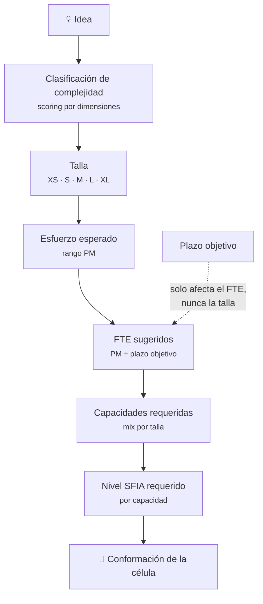

**Regla estructural:** el plazo objetivo **no** modifica la talla. Una iniciativa sigue siendo L aunque deba salir en 3 o en 12 meses; lo que cambia es la **capacidad necesaria** (más FTE en menos tiempo).

### 1.5 Evolución esperada del modelo

Al inicio no existen históricos, por lo que las primeras reglas se construyen con criterio experto y luego se calibran con datos reales:

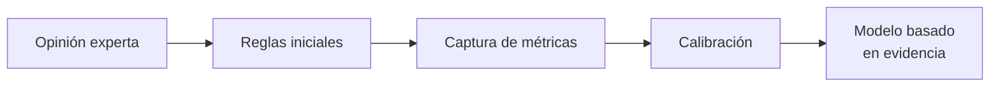

### 1.6 Riesgos identificados en el modelo

| Riesgo | Mitigación |
|---|---|
| **Subjetividad** — dos personas clasifican distinto la misma iniciativa | Preguntas objetivas, reglas claras, rangos definidos |
| **Confundir esfuerzo con seniority** — mucho trabajo ≠ más seniors | Complejidad y volumen son variables distintas y separadas en el scoring |
| **Personas con múltiples capacidades** — alguien cubre arquitectura + seguridad | El modelo debe contemplarlo (ver [RN-38](#rn-38)) |
| **Disponibilidad real** — 0.5 FTE no significa que esa capacidad esté disponible | El FTE disponible se declara por persona y se contrasta con la utilización real |
| **Burocracia** — demasiadas preguntas vuelven el modelo inusable | Triaje previo de 6 preguntas que permite vía rápida (XS–S) sin evaluación completa |

---

## 2. Glosario / lenguaje ubicuo

| Término | Definición | Nombre en código |
|---|---|---|
| **Célula / Squad** | Equipo estable con una tribu, una criticidad y a lo sumo una iniciativa activa | `Squad` |
| **Chapter** | Línea de expertise (Backend, QA, AS-400…) que agrupa personas **transversalmente a las células**. No es solo una etiqueta: es la línea de gestión completa (capacidad, trayectoria de carrera, permisos) | `Chapter` *(pendiente de crear)* |
| **Chapter Lead / Experto de Línea** | Persona que lidera un chapter. Es a la vez un empleado y un rol de plataforma | — |
| **Capacidad** | Una persona del equipo, con su rol, seniority, nivel SFIA, modalidad y FTE disponible. En el negocio "capacidad" se usa como sinónimo de persona | `Person` |
| **Iniciativa** | Trabajo de transformación acotado que pertenece a una célula y consume FTE | `Initiative` |
| **Allocation / Asignación** | Relación persona ↔ célula (↔ iniciativa opcional) con su % de dedicación repartido entre BAU y Transformación | `Allocation` |
| **BAU** *(Business As Usual)* | Trabajo operativo del día a día: soporte, incidentes, ceremonias, mantenimiento correctivo. Consume tiempo pero no aporta a los KR | `BauTask` |
| **Transformación** | Trabajo que construye capacidad nueva; el que consume FTE de la iniciativa activa | — |
| **FTE** *(Full Time Equivalent)* | Dedicación equivalente a tiempo completo. Rango `[0.0, 1.0]` por persona | `Fte` |
| **Talla** | Clasificación de complejidad de la iniciativa: XS, S, M, L, XL | *(VO pendiente)* |
| **PM** *(Persona-Mes)* | Unidad de esfuerzo estimado; cada talla tiene un rango `pmMin–pmMax` | — |
| **SFIA** | Nivel de responsabilidad de una capacidad. **Escala propia de Tuya, 1–4** | `SfiaLevel` |
| **Mix de capacidades** | Distribución porcentual del esfuerzo por rol y nivel SFIA requerido, derivada de la talla | *(VO pendiente)* |
| **Demanda** | FTE por capacidad que exigen las iniciativas **activas** | — |
| **Capacidad disponible** | Suma del FTE de las personas registradas, por rol | — |
| **Cobertura** | `FTE asignado ÷ FTE demandado` | — |
| **Utilización** | Suma de los % de dedicación de una persona en todas sus asignaciones | — |
| **Work item** | Elemento de trabajo espejado desde Azure DevOps (Epic, Feature, User Story, Task, Bug) | *(pendiente)* |
| **Clasificación** | Decisión sobre un work item: ¿pertenece a la Iniciativa, es BAU, o se descarta? | *(pendiente)* |
| **Curación** | Confirmación humana de que un work item asignado automáticamente a una persona realmente le corresponde | *(pendiente)* |
| **Base local / tablas espejo** | Copia local de tableros, work items e identidades que alimenta un job de ingesta. **El frontend nunca llama a Azure DevOps** | *(pendiente)* |

---

## 3. Modelo de dominio

### 3.1 Mapa de relaciones

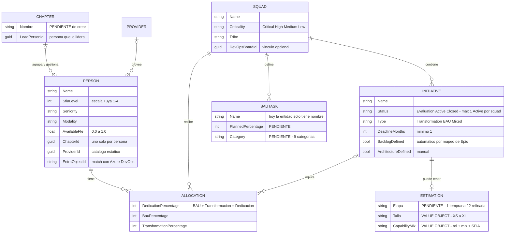

> `CHAPTER`, `ESTIMATION` y los atributos marcados `PENDIENTE` todavía no existen en el backend — ver [§9.2](#92-matriz-de-capacidades).
> `PROVIDER` es un catálogo estático fuera del alcance actual.

### 3.2 Entidades (agregados con identidad y ciclo de vida)

| Entidad | Estado | Ruta |
|---|---|---|
| `Squad` | ✅ Implementada | `backend/src/GestionCapacidad.Domain/Entities/Squad.cs` |
| `Person` | ✅ Implementada | `backend/src/GestionCapacidad.Domain/Entities/Person.cs` |
| `Initiative` | ✅ Implementada | `backend/src/GestionCapacidad.Domain/Entities/Initiative.cs` |
| `Allocation` | ✅ Implementada | `backend/src/GestionCapacidad.Domain/Entities/Allocation.cs` |
| `BauTask` | 🟡 Mínima (solo `SquadId` + `Name`) | `backend/src/GestionCapacidad.Domain/Entities/BauTask.cs` |
| `Chapter` | ❌ Pendiente — hoy `Person.ChapterId` es un Guid sin entidad destino | — |
| `Estimation` | ❌ Pendiente — el motor de scoring no existe en backend | — |
| `WorkItem` (espejo) | ❌ Pendiente | — |
| `HoursReport` | ❌ Pendiente | — |

### 3.3 Value Objects

**Decisión de diseño:** varios conceptos del dominio se modelan como **Value Objects inmutables dentro de un agregado**, no como entidades con CRUD y repositorio propio. El backend ya sigue este patrón.

| Value Object | Valores | Estado | Ruta |
|---|---|---|---|
| `Fte` | `[0.0, 1.0]` | ✅ | `.../ValueObjects/Fte.cs` |
| `Percentage` | `[0, 100]` | ✅ | `.../ValueObjects/Percentage.cs` |
| `Criticality` | Critical, High, Medium, Low | ✅ | `.../ValueObjects/Criticality.cs` |
| `SfiaLevel` | 1–4 (escala Tuya) | ✅ | `.../ValueObjects/SfiaLevel.cs` |
| `Seniority` | Junior, MidLevel, Senior, StaffEngineer, Principal | ✅ | `.../ValueObjects/Seniority.cs` |
| `Modality` | Remote, Hybrid, OnSite | ✅ | `.../ValueObjects/Modality.cs` |
| `InitiativeType` | Transformation, BAU, Mixed | ✅ | `.../ValueObjects/InitiativeType.cs` |
| `InitiativeStatus` | Evaluation, Active, Closed | ✅ | `.../ValueObjects/InitiativeStatus.cs` |
| **`Talla`** | XS, S, M, L, XL + bandas de puntaje y rango PM | ❌ **Pendiente — será VO** | — |
| **`ScoringQuestion`** | dimensión, texto, peso, tipo | ❌ **Pendiente — será VO** | — |
| **`CapabilityMix`** | rol + % del mix + SFIA requerido | ❌ **Pendiente — será VO** | — |

### 3.4 Escala SFIA de Tuya (canónica)

| Nivel | Etiqueta | Significado |
|---|---|---|
| 1 | Principiante | Conocimiento básico, requiere guía constante |
| 2 | Competente | Trabaja con supervisión ocasional |
| 3 | Avanzado | Autónomo, resuelve problemas complejos |
| 4 | Experto | Referente técnico, guía a otros |

> ⚠️ **Las otras escalas que aparecen en el material histórico son obsoletas** y no deben usarse: el contexto original ejemplifica con SFIA estándar (niveles 3–5), el MVP v1 usa 0–7 y `HU_capacidad_personas_asignacion.md` dice "1 a 5". Al portar el mix de capacidades del MVP v1 hay que **remapear** a 1–4, no copiar los valores tal cual.

### 3.5 Catálogos y código fuera del dominio

| Elemento | Naturaleza | Decisión |
|---|---|---|
| `Provider` | Maestro estático semilla en base de datos | Fuera de alcance de la plataforma por ahora. Sirve para saber cuántas capacidades hay por proveedor. CRUD posible a futuro, **no priorizado** |
| `Company` / `CompanyRegistryClient` | Código de ejemplo de la plantilla organizacional | **No es dominio de negocio.** Se conserva como guía del patrón (mapeo manual, integración externa con `IRestClient`) para generar nuevas clases. Eliminable a futuro |
| `GestionCapacidad.Core/RabbitMQ` | Scaffolding de la plantilla organizacional | Sin uso de negocio hoy. Reservado para el futuro job de ingesta desde Azure DevOps |
| `RestClient` | Librería de la plantilla | Infraestructura reutilizable |

---

## 4. Roles y permisos

La **autenticación es externa al backend** por diseño (`backend/ARCHITECTURE.md`): OAuth 2.0 con identidades federadas y Entra ID, expuesto vía APIM ante AKS. Los roles listados aquí son **autorización de negocio**, no autenticación.

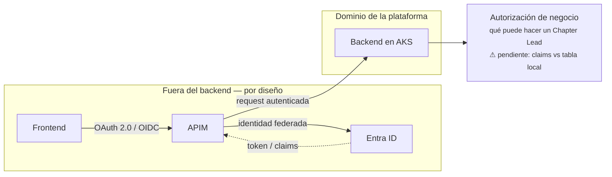

### 4.1 Roles

| Rol | Quién es | Responsabilidad principal |
|---|---|---|
| **Chapter Lead** *(Experto de Línea)* | Persona que lidera una línea de expertise | Rol protagonista. Gestiona su chapter de extremo a extremo |
| **Capacidad / Colaborador** | Cualquier persona del equipo (dev, QA, arquitecto…) | Reporta sus horas por sprint y cura sus propios work items |
| **Admin de plataforma** | Administrador técnico | Configuración global: calendario de sprints, conexión DevOps, parámetros del modelo |
| **Evaluador de iniciativa** | Chapter Lead o PO, según el caso | Responde el formulario de scoring de la Etapa 1 |
| **Arquitecto** | Arquitecto de solución | Aprueba el diseño que desbloquea la Etapa 2 de estimación |
| **Product Owner / Negocio** | Dueño de la iniciativa | Consume portafolio, tallas y recomendaciones de staffing |

> **Nota histórica:** "Experto de Línea" (MVP v2) y "Chapter Lead" (MVP v5/v6) son **el mismo rol** con distinto nombre. Se adopta **Chapter Lead** como nombre canónico.

### 4.2 Matriz rol × acción

| Acción | Chapter Lead | Colaborador | Admin | Arquitecto | PO |
|---|:---:|:---:|:---:|:---:|:---:|
| Crear / editar células | ✅ | — | — | — | — |
| Crear / editar iniciativas | ✅ | — | — | — | 👁 |
| Activar iniciativa | ✅ | — | — | — | — |
| Crear / editar capacidades (personas) | ✅ | — | — | — | — |
| Asignar personas (allocations) | ✅ | — | — | — | — |
| Rebalancear entre células | ✅ | — | — | — | — |
| Evaluar iniciativa (scoring Etapa 1) | ✅ | — | — | — | ✅ |
| Marcar "arquitectura definida" | ✅ | — | — | ✅ | — |
| Clasificar backlog (Iniciativa/BAU/Descartar) | ✅ | — | — | — | — |
| Curar work items propios | ✅ | ✅ | — | — | — |
| Reportar horas del sprint | — | ✅ | — | — | — |
| Validar reportes de horas | ✅ | — | — | — | — |
| Vincular tablero DevOps ↔ célula | ✅ | — | ✅ | — | — |
| Vincular identidad Entra ID ↔ capacidad | ✅ | — | ✅ | — | — |
| Configurar calendario de sprints | — | — | ✅ | — | — |
| Editar parámetros del modelo (tallas, pesos, mix) | — | — | ✅ | — | — |
| Configurar conexión Azure DevOps | — | — | ✅ | — | — |
| Ejecutar ingesta manual | ✅ | — | ✅ | — | — |
| Ver portafolio y capacidad vs demanda | ✅ | 👁 | 👁 | 👁 | ✅ |

Leyenda: ✅ puede ejecutar · 👁 solo lectura · — sin acceso

---

## 5. Módulos y submódulos

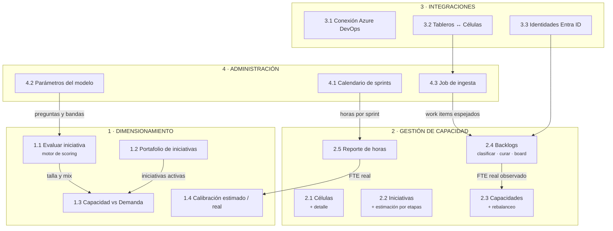

### 5.1 Módulo Dimensionamiento

| Submódulo | Qué hace | Estado |
|---|---|---|
| **1.1 Evaluar iniciativa** | Triaje de 6 preguntas → formulario de scoring (30 preguntas en 7 dimensiones con pesos) → puntaje → talla → rango PM → FTE (optimista/medio/pesimista) → mix de capacidades con SFIA requerido | ❌ Pendiente en backend |
| **1.2 Portafolio** | Lista de iniciativas evaluadas con talla, PM, FTE, plazo y estado; KPIs agregados | ❌ Pendiente |
| **1.3 Capacidad vs Demanda** | Demanda agregada de las iniciativas **activas** vs capacidad disponible por rol; brecha y semáforo | ❌ Pendiente |
| **1.4 Calibración** | Registro de estimado vs real al cierre; desviación y factor de ajuste sugerido | ❌ Pendiente (algoritmo por definir) |

**Dimensiones del scoring** (del MVP v1, 30 preguntas con peso 1–3):

1. Negocio y cliente · 2. Alcance funcional · 3. Integraciones · 4. Datos, seguridad y cumplimiento · 5. Tecnología y arquitectura · 6. Operación y soporte · 7. Incertidumbre y dependencias

**Tipos de pregunta:**
- **Tipo A · Objetivas** — se responden con cantidades (¿cuántos sistemas? ¿cuántas áreas?). Opciones cuantitativas: `0 / 1-2 / 3-5 / 6-10 / más de 10`.
- **Tipo B · Evaluativas** — juicio experto (sensibilidad de datos, criticidad). Escala: `No aplica / Bajo / Medio / Alto / Crítico`.

**Bandas de talla** (parametrizables):

| Talla | Puntaje % | PM | Lectura |
|---|---|---|---|
| XS | 0–20 | 1–3 | Cambio menor o ajuste acotado |
| S | 21–35 | 3–8 | Iniciativa pequeña con alcance conocido |
| M | 36–50 | 8–16 | Iniciativa media con varias piezas o integraciones |
| L | 51–70 | 16–32 | Iniciativa grande, transversal o con riesgo relevante |
| XL | 71–100 | 32–64 | Programa estratégico de alta incertidumbre |

### 5.2 Módulo Gestión de Capacidad

| Submódulo | Qué hace | Estado |
|---|---|---|
| **2.1 Células** | CRUD de squads (nombre, tribu, criticidad, descripción) + vínculo opcional a tablero DevOps + detalle con tabs Resumen/Backlog/Board/Equipo | ✅ CRUD · 🟡 vínculo DevOps |
| **2.2 Iniciativas** | CRUD anidado bajo célula, cambio de estado, panel de estimación por etapas con gate de prerequisitos | ✅ CRUD · ❌ estimación |
| **2.3 Capacidades** | CRUD de personas + asignación a chapter/proveedor + allocations + detección de sobreasignación + rebalanceo | ✅ CRUD · ❌ rebalanceo |
| **2.4 Backlogs** | Clasificación de work items (Iniciativa/BAU/Descartado) + bandeja de curación + Squad Board | ❌ Pendiente |
| **2.5 Reporte de horas** | Captura individual por sprint, conversión horas→FTE, validación de rango, cobertura por célula, validación del Chapter Lead | ❌ Pendiente |

**Catálogo de categorías BAU** (del MVP v6):

1. Soporte y operación en producción · 2. Mantenimiento correctivo · 3. Mantenimiento preventivo / mejoras · 4. Documentación técnica · 5. Gestión de conocimiento / onboarding · 6. Ceremonias y reuniones de equipo · 7. Soporte a otros equipos / consultoría interna · 8. Seguridad y compliance · 9. Otro BAU

### 5.3 Módulo Integraciones

**Arquitectura backend-driven (principio no negociable):** el frontend **nunca** llama a Azure DevOps. Un job del backend baja tableros, work items e identidades a tablas espejo locales, y la plataforma expone endpoints que consumen esa base.

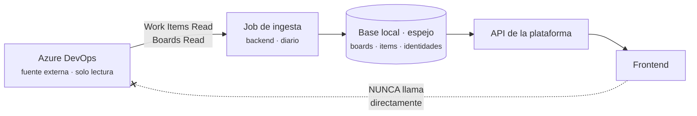

| Submódulo | Qué hace | Estado |
|---|---|---|
| **3.1 Conexión** | Organización, proyecto, Service Principal (Entra ID). **Solo lectura**: la plataforma nunca escribe en DevOps | ❌ Pendiente |
| **3.2 Tableros ↔ Células** | Vínculo curado en dos sesiones (explorar/shortlist → decidir/confirmar) | 🟡 Dominio listo, sin endpoints |
| **3.3 Usuarios Entra ID** | Match de identidades DevOps ↔ capacidades por `entraObjectId`, con fallback a UPN y vinculación manual persistida | ❌ Pendiente (campos ya existen en `Person`) |

### 5.4 Módulo Administración

| Submódulo | Qué hace | Estado |
|---|---|---|
| **4.1 Calendario de sprints** | Semanas por sprint, horas por semana, sprints por quarter, tolerancia de reporte. Fuente única de verdad para convertir horas → FTE | ❌ Pendiente |
| **4.2 Parámetros del modelo** | Tallas y bandas, pool de preguntas y pesos, mix de capacidades y SFIA por talla | ❌ Pendiente |
| **4.3 Job de ingesta** | Estado de la última corrida, volúmenes espejados, ejecución manual | ❌ Pendiente |

---

## 6. Catálogo de reglas de negocio

**Leyenda de origen:** `CÓDIGO` = verificada en el backend · `MVP` = definida en los prototipos · `CONTEXTO` = del modelo conceptual o las HU · `DECISIÓN` = acordada en la sesión de exploración.
**Leyenda de estado:** ✅ implementada · 🟡 parcial · ❌ pendiente

### 6.1 Iniciativas

| ID | Regla | Origen | Estado |
|---|---|---|---|
| **RN-01** | Una célula puede tener **como máximo una iniciativa en estado `Active`**. Para activar otra hay que cerrar o mover la actual | `CÓDIGO` `ChangeInitiativeStatusUseCase.cs:24-32` | ✅ |
| **RN-02** | Toda iniciativa nace en estado `Evaluation` | `CÓDIGO` `Initiative.cs:24` | ✅ |
| **RN-03** | Estados válidos: `Evaluation`, `Active`, `Closed` | `CÓDIGO` `InitiativeStatus.cs` | ✅ |
| **RN-04** | Tipos válidos: `Transformation`, `BAU`, `Mixed` | `CÓDIGO` `InitiativeType.cs` | ✅ |
| **RN-05** | El deadline debe ser **de al menos 1 mes** | `CÓDIGO` `Initiative.cs:113-118` | ✅ |
| **RN-06** | El nombre es obligatorio y no puede exceder **300 caracteres** | `CÓDIGO` `Initiative.cs:102-110` | ✅ |
| **RN-07** | La iniciativa **siempre pertenece a una célula** (`SquadId` obligatorio) | `CÓDIGO` `Initiative.cs:16-17` | ✅ |
| **RN-08** | **Estimar es opcional**: nunca bloquea crear, activar ni asignar una iniciativa | `MVP` v4/v5/v6 | ✅ (por omisión) |
| **RN-09** | Solo las iniciativas en estado `Active` **generan demanda** de capacidad | `CONTEXTO` HU-CD-03 | ❌ |

### 6.2 Asignaciones (Allocations)

| ID | Regla | Origen | Estado |
|---|---|---|---|
| **RN-10** | `BAU% + Transformación%` debe **igualar exactamente** el `% de Dedicación` | `CÓDIGO` `Allocation.cs:83-85` | ✅ |
| **RN-11** | El % de dedicación debe ser **al menos 1%** | `CÓDIGO` `Allocation.cs:80-81` | ✅ |
| **RN-12** | La dedicación **total de una persona no puede exceder 100%** sumando todas sus células | `CÓDIGO` `CreateAllocationUseCase.cs:41-47` | ✅ |
| **RN-13** | Una persona **no puede tener dos asignaciones en la misma célula**; debe actualizarse la existente | `CÓDIGO` `CreateAllocationUseCase.cs:37-38` | ✅ |
| **RN-14** | Todo porcentaje está en el rango `[0, 100]` | `CÓDIGO` `Percentage.cs` | ✅ |
| **RN-15** | La asignación requiere que existan **la persona y la célula** | `CÓDIGO` `CreateAllocationUseCase.cs:29-35` | ✅ |

### 6.3 Personas / Capacidades

| ID | Regla | Origen | Estado |
|---|---|---|---|
| **RN-16** | El FTE disponible está en el rango **`[0.0, 1.0]`** | `CÓDIGO` `Fte.cs:16-21` | ✅ |
| **RN-17** | El nivel SFIA usa la **escala propia de Tuya, 1–4** (Principiante/Competente/Avanzado/Experto) | `CÓDIGO` `SfiaLevel.cs` + `DECISIÓN` | ✅ |
| **RN-18** | El costo mensual debe ser **cero o mayor** | `CÓDIGO` `Person.cs:204-211` | ✅ |
| **RN-19** | Seniority válido: Junior, MidLevel, Senior, StaffEngineer, Principal | `CÓDIGO` `Seniority.cs` | ✅ |
| **RN-20** | Modalidad válida: Remote, Hybrid, OnSite | `CÓDIGO` `Modality.cs` | ✅ |
| **RN-21** | **Una persona pertenece a un único chapter.** El chapter no es solo agrupación por habilidad: es la línea de gestión completa (capacidad, trayectoria de carrera, permisos) | `DECISIÓN` | 🟡 (`ChapterId` existe, falta entidad) |
| **RN-22** | Si la modalidad es **Externo**, el proveedor es obligatorio | `MVP` v6 | ❌ |
| **RN-23** | Sin identidad de DevOps vinculada, **los work items de esa persona no cuentan** en ninguna vista | `MVP` v3/v5/v6 | ❌ |
| **RN-24** | Nombre, documento, UPN, cargo y rol son obligatorios con límites de longitud (200/50/250/100/100) | `CÓDIGO` `Person.cs:174-202` | ✅ |

### 6.4 Células (Squads)

| ID | Regla | Origen | Estado |
|---|---|---|---|
| **RN-25** | Criticidad válida: Critical, High, Medium, Low | `CÓDIGO` `Criticality.cs` | ✅ |
| **RN-26** | Nombre (máx. 200) y tribu (máx. 100) obligatorios; descripción opcional (máx. 500) | `CÓDIGO` `Squad.cs:86-106` | ✅ |
| **RN-27** | Un tablero de DevOps solo puede estar vinculado a **una** célula | `MVP` v6 | ❌ |
| **RN-28** | El vínculo con el tablero es **opcional** al crear la célula; puede hacerse después | `MVP` v6 | 🟡 |
| **RN-29** | Al desvincular el tablero, el backlog de esa célula **deja de actualizarse** | `MVP` v6 | ❌ |

### 6.5 BAU

| ID | Regla | Origen | Estado |
|---|---|---|---|
| **RN-30** | La suma de los % de todas las tareas BAU de una célula **no debe exceder 100%** | `MVP` v3/v4 | ❌ |
| **RN-31** | El BAU **planeado** se declara por tarea; el BAU **real** se deriva de los reportes de horas | `MVP` v3–v6 | ❌ |
| **RN-32** | Si el BAU real supera al planeado, la célula se marca con alerta "BAU creciendo" | `MVP` v5/v6 | ❌ |
| **RN-33** | El nombre de la tarea BAU es obligatorio (máx. 200) y pertenece a una célula | `CÓDIGO` `BauTask.cs:14-21,36-45` | ✅ |

### 6.6 Dimensionamiento y estimación

| ID | Regla | Origen | Estado |
|---|---|---|---|
| **RN-34** | **El plazo objetivo no modifica la talla.** Cambia el FTE necesario, no la complejidad | `CONTEXTO` | ❌ |
| **RN-35** | `FTE = PM ÷ plazo en meses`; se calculan tres escenarios (optimista con `pmMin`, medio, pesimista con `pmMax`) | `MVP` v1 | ❌ |
| **RN-36** | Etapa 1 (T-Shirt Sizing) tiene incertidumbre **±50-100%**; Etapa 2 (COCOMO II) la reduce a **±25%** | `MVP` v3–v6 | ❌ |
| **RN-37** | La Etapa 2 requiere **3 prerequisitos**: Etapa 1 completada, backlog definido (automático) y arquitectura definida (manual) | `MVP` v3–v6 · `CÓDIGO` `Initiative.cs:39-43` | 🟡 (flags existen) |
| **RN-38** | Una persona puede cubrir varias capacidades del mix (arquitectura + seguridad + performance); el modelo debe contemplarlo | `CONTEXTO` | ❌ |
| **RN-39** | Las preguntas cuantitativas deben tener **respuestas cuantitativas** (rangos numéricos), nunca escalas Bajo/Medio/Alto | `CONTEXTO` | ❌ |
| **RN-40** | El pool de preguntas, los pesos y las bandas de talla son **parametrizables** y los sirve el backend, no el cliente | `DECISIÓN` | ❌ |
| **RN-41** | El triaje previo determina la ruta: crítica o ≥3 respuestas afirmativas → evaluación completa obligatoria; ≥1 → recomendada; 0 → vía rápida XS–S | `MVP` v1 | ❌ |

### 6.7 Reporte de horas y sprints

| ID | Regla | Origen | Estado |
|---|---|---|---|
| **RN-42** | `FTE = horas reportadas ÷ (semanas por sprint × horas por semana)` | `MVP` v3–v6 | ❌ |
| **RN-43** | El total reportado debe caer en `horas_sprint ± tolerancia` (por defecto **76–84 h**) para poder enviarse | `MVP` v3–v6 | ❌ |
| **RN-44** | Cambiar el calendario de sprints **no recalcula** los sprints ya reportados | `MVP` v3–v6 | ❌ |
| **RN-45** | Cada persona reparte sus horas entre tres tipos de destino: **Iniciativa**, **BAU** (por categoría) y **Libre** | `MVP` v3–v6 | ❌ |
| **RN-46** | El calendario de sprints es la **única fuente de verdad** para el reporte de FTE y el roadmap | `MVP` v3–v6 | ❌ |

### 6.8 Integración con Azure DevOps

| ID | Regla | Origen | Estado |
|---|---|---|---|
| **RN-47** | La integración es **solo lectura**: la plataforma nunca escribe en Azure DevOps | `MVP` v3–v6 | ❌ |
| **RN-48** | El **frontend nunca llama a Azure DevOps**; consume la base local espejada por el job | `MVP` v6 | ❌ |
| **RN-49** | Un Epic/Feature solo puede pertenecer a **una** iniciativa (conflicto → HTTP 409) | `MVP` v3/v5/v6 | ❌ |
| **RN-50** | Una identidad de DevOps solo puede vincularse a **una** capacidad | `MVP` v6 | ❌ |
| **RN-51** | El match por Entra ID **no asocia automáticamente**: deja el item como candidato pendiente de curación | `MVP` v3–v6 | ❌ |
| **RN-52** | Solo los work items **confirmados en curación** alimentan el Squad Board y el FTE real | `MVP` v3–v6 | ❌ |
| **RN-53** | El rechazo en curación **exige motivo** y queda trazado (no cuenta, pero no se pierde) | `MVP` v3–v6 | ❌ |
| **RN-54** | Un cambio de `assignedTo` en un item ya curado lo **devuelve a curación** | `MVP` v3/v4/v5 | ❌ |
| **RN-55** | El mapeo de un Epic marca automáticamente el prerequisito `backlogDefined` de la Etapa 2 | `MVP` v3/v5 | ❌ |
| **RN-56** | La sincronización sigue el patrón **preview → apply**: el diff se calcula y revisa antes de aplicarse, y todo queda trazado | `MVP` v3/v4/v5 | ❌ |
| **RN-57** | Solo las User Stories necesitan clasificación (Iniciativa / BAU / Descartar); la clasificación es reversible | `MVP` v6 | ❌ |

### 6.9 Semáforos y umbrales

| ID | Regla | Origen | Estado |
|---|---|---|---|
| **RN-58** | **Cobertura** (`asignado ÷ demandado`): ≥100% verde · 50–99% ámbar · <50% rojo | `CONTEXTO` HU-PA-08 | ❌ |
| **RN-59** | Se alerta cuando el nivel SFIA de una persona asignada es **menor al requerido** por la capacidad | `CONTEXTO` HU-PA-09 | ❌ |
| **RN-60** | El balance de capacidad se muestra en verde cuando disponible ≥ demanda, en rojo cuando es menor | `CONTEXTO` HU-CD-01 | ❌ |
| **RN-61** | **Utilización** — ⚠️ **conflicto sin resolver**: `HU_capacidad_personas_asignacion.md` define ≤84% verde / 85–100% ámbar / >100% rojo, mientras que los MVPs v5/v6 usan 100% verde / >100% rojo / 60% azul (subutilizado). **Requiere decisión** | `CONTEXTO` vs `MVP` | ❌ |

---

## 7. Flujos end-to-end

### 7.1 Ciclo de vida de una iniciativa

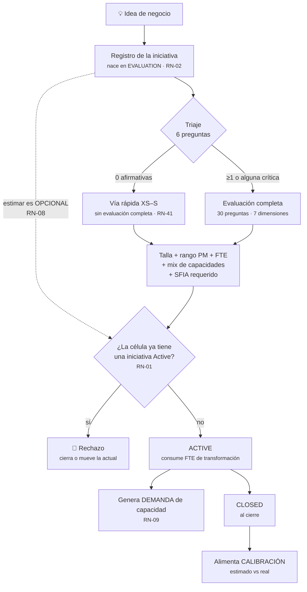

### 7.2 Ciclo del sprint

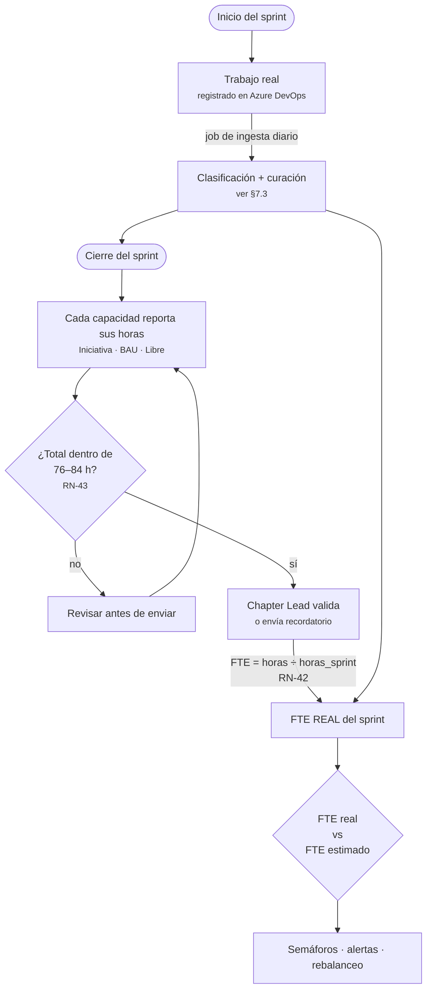

### 7.3 Ingesta DevOps → clasificación → curación → FTE real

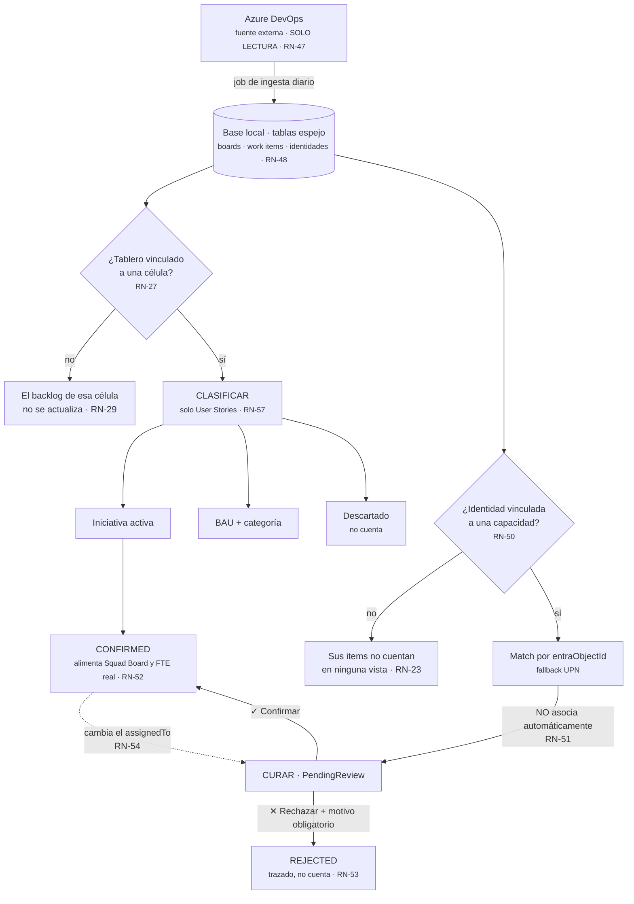

### 7.4 Detección de sobreasignación y rebalanceo

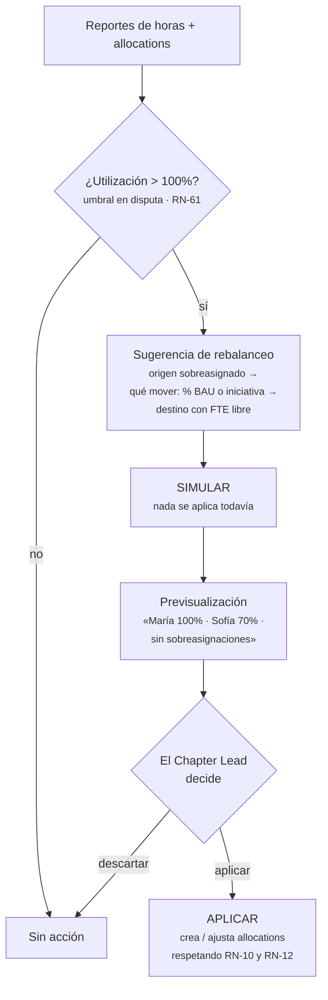

### 7.5 Capacidad vs demanda (agregado)

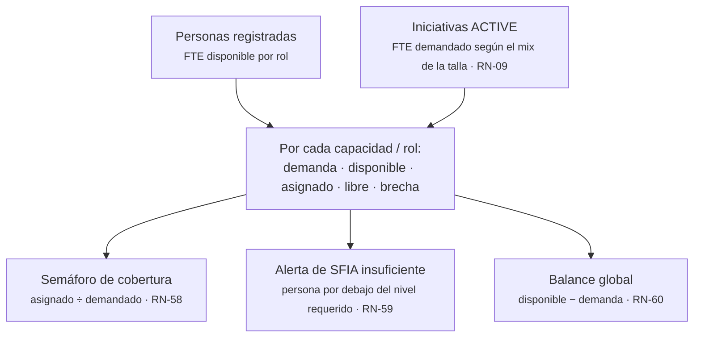

---

## 8. Cadenas de aprobación

### 8.1 Reporte de horas *(implementada en MVPs, pendiente en backend)*

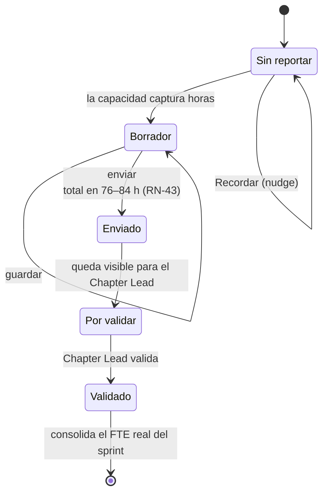
- **Quién aprueba:** Chapter Lead.
- **Gate:** el total debe estar en `horas_sprint ± tolerancia` (RN-43).
- **Efecto de la aprobación:** el FTE real del sprint se consolida y alimenta los semáforos.

### 8.2 Vínculo tablero ↔ célula

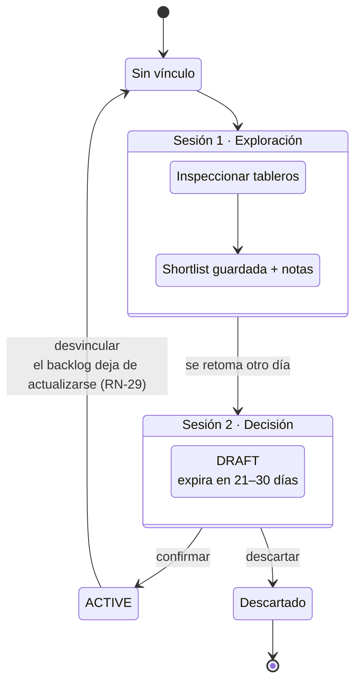
- **Por qué dos sesiones:** separar exploración de decisión evita vínculos accidentales; el borrador muestra qué implica antes de confirmar.
- **Expiración del borrador:** entre 21 y 30 días según el MVP — **valor exacto por definir**.

### 8.3 Curación de work items

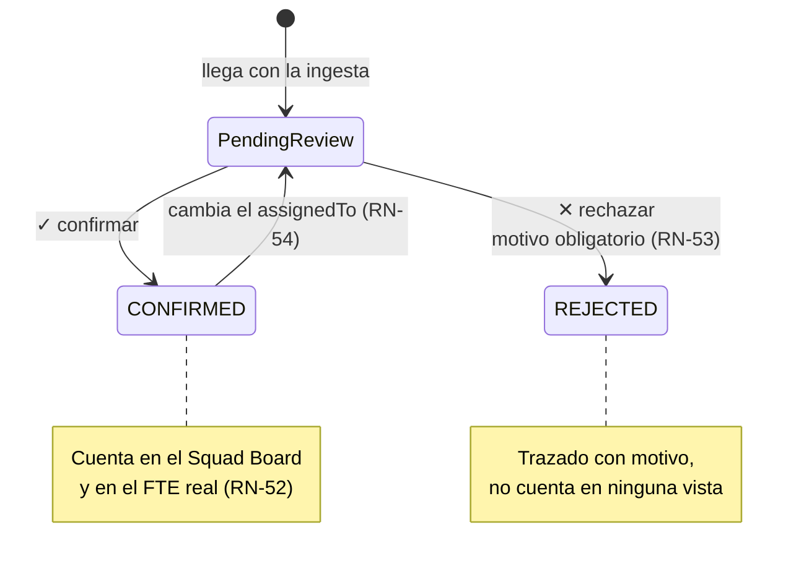
- **Quién aprueba:** Chapter Lead junto con la capacidad afectada.
- **Por qué existe:** el match automático por Entra ID puede traer items de otro equipo asignados por error en DevOps.

### 8.4 Clasificación de backlog

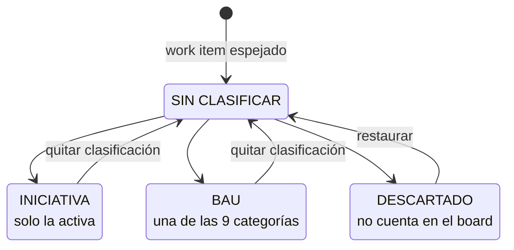

> Solo las **User Stories** requieren clasificación (RN-57). Todas las transiciones son reversibles.

### 8.5 Activación de iniciativa

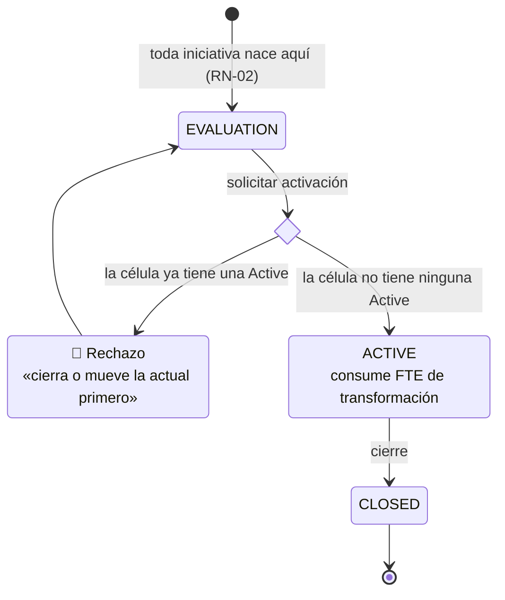

### 8.6 Estimación por etapas

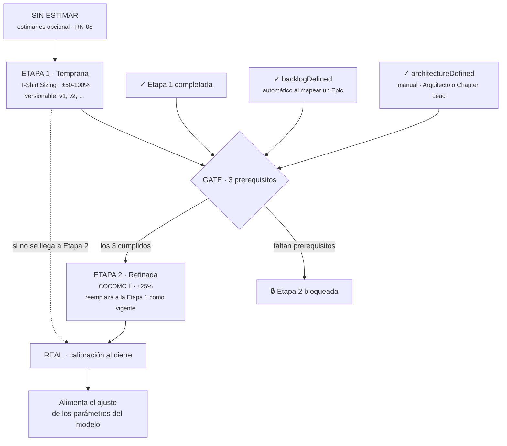

### 8.7 Rebalanceo de capacidad

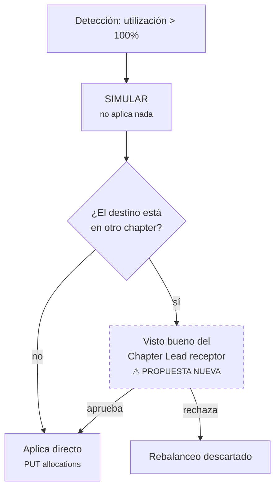
> ⚠️ La aprobación cruzada entre chapters es una **propuesta de este documento**, no aparece en los MVPs. Requiere validación.

### 8.8 Cambio de parámetros del modelo

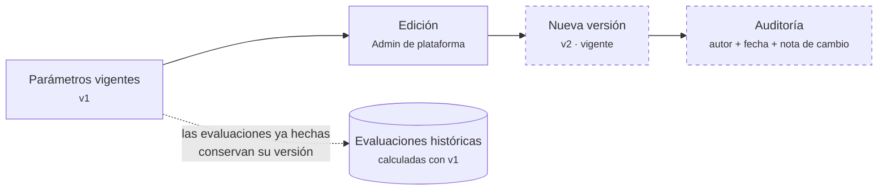
> ⚠️ El versionado con auditoría es una **propuesta** derivada del punto 13 de `funcionalidades_plataforma_research.md`. No está en los MVPs.
> Análogo a RN-44: cambiar parámetros no debería recalcular retroactivamente lo ya evaluado.

---

## 9. Estado de implementación

### 9.1 Arquitectura del backend

.NET 10, Clean Architecture (`backend/ARCHITECTURE.md`):

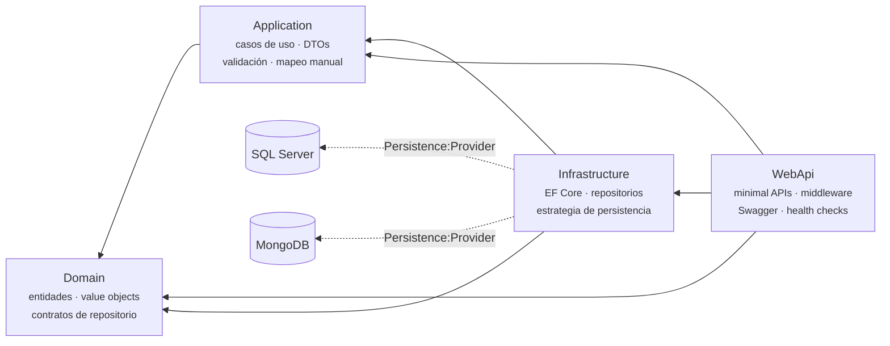

> Las flechas apuntan en el sentido de la **dependencia**: `Domain` no depende de nadie.

- **Persistencia dual** por estrategia: SQL Server o MongoDB, seleccionada por `Persistence:Provider`.
- **Endpoints:** minimal APIs agrupadas por capacidad en `WebApi/Endpoints/*.cs`, versionadas (`api/v{version}`).
- **Autenticación:** intencionalmente externa al servicio.
- **Validación:** FluentValidation dentro de los casos de uso.
- **Errores:** `ErrorHandlerMiddleware` → `ProblemDetails` (404/400/401/500).

> ⚠️ **Advertencia sobre `ARCHITECTURE.md`:** es documentación heredada de la plantilla organizacional, no 100% específica de este proyecto. Declara RabbitMQ como "fuera de alcance" mientras existe una implementación completa en `Core/RabbitMQ`. Verificar antes de tomar cualquier afirmación de ese archivo como vigente.

### 9.2 Matriz de capacidades

| Capacidad | Estado | Qué existe | Qué falta |
|---|:---:|---|---|
| **Células (Squads)** | ✅ | CRUD completo + catálogo de criticidades | — |
| **Personas (Capacidades)** | ✅ | CRUD + asignar/quitar chapter + asignar proveedor + catálogos (seniority, modality, sfia-levels) | — |
| **Iniciativas** | ✅ | CRUD anidado bajo célula + cambio de estado con RN-01 + catálogos | — |
| **Asignaciones** | ✅ | Create/Update/Delete + consultas por persona y por célula, con RN-10/12/13 | — |
| **Tareas BAU** | 🟡 | CRUD de nombre por célula | % planeado, FTE, categorías, comparación plan vs real |
| **Vínculo DevOps ↔ célula** | 🟡 | `Squad.LinkDevOpsBoard()` / `UnlinkDevOpsBoard()` + eventos de dominio | Casos de uso y endpoints que los expongan |
| **Chapters** | 🟡 | `Person.ChapterId` + casos de uso de asignar/remover | La **entidad `Chapter`** con su líder |
| **Proveedores** | 🟡 | `Person.ProviderId` + caso de uso de asignación | Entidad/catálogo (fuera de alcance por ahora) |
| **Motor de dimensionamiento** | ❌ | — | Todo: preguntas, parámetros, cálculo, mix, persistencia de evaluaciones |
| **Portafolio** | ❌ | — | Todo |
| **Capacidad vs demanda** | ❌ | — | Todo |
| **Calibración** | ❌ | — | Todo + definir el algoritmo |
| **Reporte de horas** | ❌ | — | Todo |
| **Backlog / work items** | ❌ | — | Todo |
| **Job de ingesta DevOps** | ❌ | Scaffolding de RabbitMQ disponible | Todo |
| **Calendario de sprints** | ❌ | — | Todo |
| **Roles y autorización** | ❌ | — | Definir claims vs tabla local |

### 9.3 Código que NO es dominio de negocio

| Elemento | Ruta | Tratamiento |
|---|---|---|
| `Company` + `CompanyRegistry` | `.../Entities/Company.cs`, `.../UseCases/Companies/`, `.../UseCases/CompanyRegistry/`, `WebApi/Controllers/CompanyRegistryController.cs` | Ejemplo de la plantilla. **No especificar como capacidad.** Se conserva como guía de patrón. Eliminable a futuro |
| RabbitMQ | `.../Core/RabbitMQ/` | Scaffolding. Reservado para el job de ingesta |
| RestClient | `.../Core/RestClient/` | Librería de la plantilla (incluye `Examples/OrdersApiClient.cs`, que es demo) |

---

## 10. Decisiones cerradas y puntos abiertos

### 10.1 Decisiones cerradas *(sesión de exploración, 2026-08-07)*

| # | Tema | Decisión |
|---|---|---|
| 1 | **Escala SFIA** | Se usa la **escala propia de Tuya, 1–4**, ya implementada en `SfiaLevel.cs`. Las escalas del contexto (3–5), del MVP v1 (0–7) y de las HU (1–5) quedan obsoletas |
| 2 | **RabbitMQ** | Scaffolding de la plantilla organizacional. Se **reserva** para el futuro job que sincronice tableros de Azure DevOps |
| 3 | **Company / CompanyRegistry** | Implementación de ejemplo de la plantilla. **No es dominio.** Se usa como guía para generar nuevas clases/entidades; eliminable a futuro |
| 4a | **Chapter** | Es una **entidad real de negocio**: el experto de línea que lidera capacidades. Es a la vez una persona de la compañía y un rol de plataforma |
| 4b | **Cardinalidad Persona↔Chapter** | **Una persona pertenece a un único chapter.** Razón: el chapter no solo gestiona capacidad y asignación, también trayectoria de carrera y permisos. El modelo actual (`ChapterId` simple) **ya es correcto**; no se requiere tabla pivote |
| 4c | **Provider** | Información base de las capacidades (para saber cuántas hay por proveedor). Maestro estático en base de datos. **Fuera del alcance** de la plataforma por ahora; CRUD posible a futuro |
| 5 | **Motor de dimensionamiento** | **Debe implementarse en el backend.** El pool de preguntas y las tablas de parámetros de tallaje los sirve el backend, no el cliente |
| 6 | **BauTask** | Alcance ambicioso: es el **arma principal del Chapter Lead** para gestionar capacidades. Permite saber en qué trabaja cada capacidad, si cumple el FTE definido o se está dedicando más a BAU, detectar sobreestimación y prospectos de rebalanceo. Depende del job de ingesta y del refinamiento/clasificación de tareas |
| 7 | **Modality y Criticality** | Metadatos descriptivos por ahora, sin regla de negocio activa. Valor futuro en reportes y visibilidad |
| 8 | **Value Objects** | Varias piezas del dominio serán **VOs, no entidades con CRUD**: `Talla`, `ScoringQuestion`, `CapabilityMix` |
| 9 | **Autenticación** | OAuth 2.0 entre frontend y backend, con identidades federadas y Entra ID; APIM expone los servicios de AKS. **Implementación concreta pendiente** |

### 10.2 Puntos abiertos

| # | Tema | Qué falta decidir | Impacto |
|---|---|---|---|
| **A-01** | **Umbrales de utilización** | Conflicto entre HU (≤84 verde / 85-100 ámbar / >100 rojo) y MVPs v5/v6 (100 verde / >100 rojo / 60 azul). Ver RN-61 | Alto: afecta todos los semáforos de capacidad |
| **A-02** | **Algoritmo de calibración** | Cómo se ajustan las tablas de parámetros con datos reales (estimado vs real) | Alto: define el módulo 1.4 |
| **A-03** | **Autorización de negocio** | ¿Los roles vienen como claims resueltos desde APIM/Entra ID, o hay una tabla de roles/permisos local? | Alto: afecta todos los módulos |
| **A-04** | **Chapter Lead: modelado** | ¿`Chapter.LeadPersonId` apunta a la Persona líder, o el líder se identifica por su propio `ChapterId`? ¿"Pertenecer" y "liderar" son dos relaciones distintas? | Medio: define la entidad `Chapter` |
| **A-05** | **Expiración del borrador de vínculo** | 21 días (v5) vs 30 días (v3) | Bajo |
| **A-06** | **Clasificación de work items** | Reglas concretas de refinamiento: qué determina que una tarea "baje" a la plataforma y cómo se decide su categoría BAU | Alto: define el módulo 2.4 |
| **A-07** | **Alcance real de BauTask** | Confirmar si el % planeado se declara por célula, por persona, o ambos | Medio |
| **A-08** | **Aprobación cruzada de rebalanceo** | ¿Un rebalanceo entre chapters requiere visto bueno del Chapter Lead receptor? (propuesta 8.7) | Medio |
| **A-09** | **Versionado de parámetros** | ¿Se versionan los parámetros del modelo con auditoría? (propuesta 8.8) | Medio |
| **A-10** | **Remapeo del mix de capacidades** | La tabla capacidad→SFIA por talla del MVP v1 está en escala 0–7; hay que remapearla a 1–4 con criterio experto | Alto: bloquea el módulo 1.1 |

---

## 11. Anexo · trazabilidad

### 11.1 Qué aportó cada MVP histórico

| MVP | Foco | Aporte único | Absorbido en v7 |
|---|---|---|---|
| **v1** | Modelo de scoring | Motor completo: 7 dimensiones, 30 preguntas con pesos, triaje, tallas, mix de capacidades, gauge, temas azul/Tuya | ✅ Lógica + diseño |
| **v2** | Costos y expertos de línea | Dimensión económica (costo por persona/célula/proveedor), concordancia seniority-costo-criticidad, mapa de conocimientos, span de control, carga masiva | 🟡 Parcial |
| **v3** | Squad capacity + DevOps | Integración DevOps completa, vinculación en 2 sesiones, sync preview→apply, identidades Entra ID, curación, reporte de horas, estimación por etapas, calendario de sprints | ✅ |
| **v4** | UX rediseñada | Journey de 3 pasos (configura/opera/analiza), "Pendientes para ti", wizard guiado de 4 pasos, anillos de progreso | ✅ Patrones UX |
| **v5** | Chapter Lead | Vista transversal multi-célula, torre de control, alertas del chapter, rebalanceo entre células, bus factor | ✅ |
| **v6** | Backend-driven | Arquitectura de base local espejada, formularios de alta con vinculación opcional, clasificación inline por pill-menu, job de ingesta | ✅ |

### 11.2 Trazabilidad de fuentes

| Concepto | Contexto conceptual | MVP | Backend |
|---|---|---|---|
| Talla y scoring | ✅ definido | v1 (implementado) | ❌ ausente |
| Mix de capacidades + SFIA | ✅ definido | v1 (escala 0–7) | 🟡 solo `SfiaLevel` 1–4 |
| Células | — | v2, v5, v6 | ✅ `Squad` |
| Personas | — | v2, v4, v6 | ✅ `Person` |
| Iniciativas | ✅ | v3, v5, v6 | ✅ `Initiative` |
| Asignaciones BAU/Transf | ✅ HU | v2 | ✅ `Allocation` |
| BAU como gestión | — | v3, v4, v5, v6 | 🟡 `BauTask` mínima |
| Reporte de horas | — | v3, v4, v5, v6 | ❌ |
| DevOps | — | v3, v4, v5, v6 | 🟡 solo `DevOpsBoardId` |
| Chapters | — | v2 (líneas), v5, v6 | 🟡 solo `ChapterId` |
| Capacidad vs demanda | ✅ HU Módulo 2 | v1, v2 | ❌ |
| Calibración | ✅ research | v3 (etapas) | ❌ |

### 11.3 Documentos fuente

| Documento | Ubicación | Vigencia |
|---|---|---|
| Modelo conceptual | `context/Contexto_Modelo_Dimensionamiento_Celulas_TI.md` | ✅ Vigente (salvo escala SFIA) |
| DOR Arquitectura | `context/DOR Arquitectura Plataforma Dimensionamiento y Capacidad.pptx` | Sin revisar en esta consolidación |
| Historias de usuario | `frontend/modelo_capacidad/HU_capacidad_personas_asignacion.md` | 🟡 Vigente salvo escala SFIA (dice 1–5) y umbrales de utilización (A-01) |
| Research de funcionalidades | `frontend/modelo_capacidad/funcionalidades_plataforma_research.md` | ✅ Vigente como roadmap |
| Arquitectura backend | `backend/ARCHITECTURE.md` | ⚠️ Heredado de plantilla; verificar antes de citar |
| MVP vigente | `mvps/plataforma_dimensionamiento_v7_unificado.html` | ✅ |
| MVPs históricos | `mvps/_historico/` | 📦 Archivados |

### 11.4 Propuesta de organización de capacidades para OpenSpec

Agrupación sugerida y orden de especificación (de menor a mayor dependencia e incertidumbre):

```mermaid
flowchart LR
    subgraph GA ["① GRUPO A · Ya implementadas (spec as-built)"]
        direction TB
        A["squads · people<br/>initiatives · allocations"]
    end
    subgraph GB ["② GRUPO B · Parcialmente implementadas"]
        direction TB
        B["chapters<br/><small>falta la entidad</small>"]
        B2["squad-devops-link<br/><small>falta el endpoint</small>"]
    end
    subgraph GD ["③ GRUPO D · Motor de dimensionamiento"]
        direction TB
        D["initiative-sizing<br/><small>preguntas + parámetros<br/>+ talla + mix + SFIA</small>"]
        D2["estimation-calibration<br/><small>algoritmo pendiente · A-02</small>"]
    end
    subgraph GE ["④ GRUPO E · Portafolio y capacidad agregada"]
        direction TB
        E["initiative-portfolio"]
        E2["capacity-demand-balance"]
    end
    subgraph GC ["⑤ GRUPO C · Cadena DevOps (la más ambiciosa)"]
        direction TB
        C1["devops-sync"] --> C2["bau-tasks<br/><small>evolucionado</small>"] --> C3["chapter-oversight"]
    end

    GA --> GB --> GD --> GE --> GC
    GA -.->|"base de datos<br/>de personas y células"| GE
    GD -.->|"talla y mix"| GE
    GB -.->|"vínculo de tableros"| GC

    OUT["🚫 FUERA DE ALCANCE<br/><small>companies / company-registry — plantilla<br/>providers — catálogo estático</small>"]
    style OUT fill:#f5f5f5,stroke-dasharray: 5 5
```

**Orden recomendado:** A → B → D → E → C, dejando autorización/roles (A-03) como pendiente transversal que se resuelve al llegar a `chapter-oversight`.
