# Roles y permisos · Plataforma de Dimensionamiento y Capacidad

> **Estado:** propuesta para cerrar los roles · **Fecha:** 2026-08-27
> **Fuentes:** `Especificacion_Plataforma_Dimensionamiento_Capacidad.md` (§4 roles, §7 flujos, §8 cadenas de aprobación) · frontend (`app/router/routes.tsx`, `features/auth-session`, `PersonRole` en `features/people/services/personService.ts`, mocks `chapters.ts` / `scope.ts`) · MVP v7 (`NAV.lead`, `NAV.colab`, `NAV.admin`).
> **Convención:** ✅ existe · 🟡 parcial · ❌ por construir · ⚠ decisión pendiente (§12).

## Tabla de contenido

1. [Modelo de roles](#1-modelo-de-roles)
2. [Nombre del rol QA / Dev](#2-nombre-del-rol-qa--dev)
3. [Administrador de plataforma](#3-administrador-de-plataforma)
4. [Líder de Expertise](#4-líder-de-expertise)
5. [Líder Técnico](#5-líder-técnico)
6. [Product Owner](#6-product-owner)
7. [Colaborador](#7-colaborador)
8. [Matriz rol × acción](#8-matriz-rol--acción)
9. [Cadenas de aprobación entre roles](#9-cadenas-de-aprobación-entre-roles)
10. [Pantallas para cerrar los roles](#10-pantallas-para-cerrar-los-roles)
11. [Mapeo técnico: Entra ID, sesión y ámbito](#11-mapeo-técnico-entra-id-sesión-y-ámbito)
12. [Decisiones pendientes](#12-decisiones-pendientes)

---

## 1. Modelo de roles

Cinco roles. El catálogo `PersonRole` del código ya los nombra (`Administrator`, `ExpertiseLead`, `TechnicalLead`, `ProductOwner`, `Contributor`); lo que falta es darles sesión, ámbito y pantallas. Cada rol se define por **quién es** y por **qué alcanza a ver** — el ámbito lo acota el servidor, no la pantalla (regla ya implementada para el Líder de Expertise en `mocks/handlers/scope.ts`).

| Rol | Quién es | Ámbito de datos | Hoy |
|---|---|---|---|
| **Administrador** | Administrador técnico de la plataforma | Configuración global. Sin datos de personas por defecto | ✅ shell `/app/admin` · rol `admin` |
| **Líder de Expertise** *(Chapter Lead)* | Lead de una línea de expertise (Backend, QA, Datos…) | Su **línea**: las personas de la línea estén en la célula que estén | ✅ shell `/app/lead` · rol `chapter-lead` |
| **Líder Técnico** | Líder técnico de una célula, designado por el Líder de Expertise | Su **célula**: el equipo que la integra, venga de la línea que venga | ❌ sólo un dato informativo de la ficha (`technicalLeadId`) |
| **Product Owner** | Dueño de una o más iniciativas | Sus **iniciativas**: las ve como demanda, no como capacidad | ❌ sólo texto libre en la iniciativa |
| **Colaborador** *(QA, Dev, arquitecto que no lidera)* | Quien ejecuta el trabajo | Lo **propio**: sus horas, sus work items, sus ausencias, su plan | ❌ shell `colab` sólo en el MVP v7 |

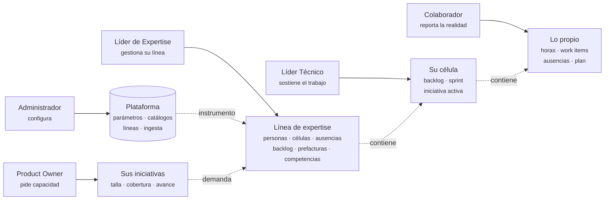

Reglas del modelo:

- **Dos ejes que no se confunden.** La línea es vertical (transversal a células) y la gestiona el Líder de Expertise: es el dueño de las **personas**. La célula es horizontal y la sostiene el Líder Técnico: es el dueño del **trabajo**. Mover a alguien de línea no toca su célula, y al revés (decisión de `add-expertise-lines`). Cuando el trabajo necesita gente, el Líder Técnico o el Product Owner **piden capacidad** y el Líder de Expertise la resuelve (§9).
- **Colaborador es la capa base.** Todo el que existe como persona en la plataforma reporta horas, cura sus work items y solicita ausencias. Líder Técnico y Líder de Expertise heredan esas pantallas (un lead asignado a una célula también reporta); el Administrador y el Product Owner no necesariamente son capacidad de una línea.
- **Un rol de negocio por persona** (`Person.role`), **roles de sesión acumulables** (claims de Entra). Quién puede entrar como qué lo dice el token; qué alcanza a ver lo resuelve el backend a partir del `oid` (§11).
- **Sin rol Arquitecto.** El doc maestro lo lista para firmar «arquitectura definida»; aquí esa firma la absorbe el Líder Técnico (⚠ R-05). Un arquitecto que no lidera es Colaborador.

---

## 2. Nombre del rol QA / Dev

**Recomendación: Colaborador.** Es el nombre que ya usan las tres fuentes: el doc maestro (§4.1 «Capacidad / Colaborador»), el catálogo del código (`Contributor` → «Colaborador» en `people.handlers.ts`) y el shell `colab` del MVP v7. Es neutral a la disciplina (Dev, QA, arquitecto) y a tener o no célula. Su única ambigüedad —en lenguaje corporativo todo empleado es «colaborador»— se resuelve definiéndolo por exclusión: *participa sin liderar*; como cada persona tiene un solo rol de negocio, un líder nunca queda etiquetado así.

| Alternativa | A favor | En contra |
|---|---|---|
| **Integrante** | Corto, neutral, sugiere pertenencia sin jerarquía | No aparece en doc ni código; quien no tiene célula no «integra» nada |
| **Especialista** | Conversa con «línea de expertise» y «Competencias» | Colisiona con Líder de Expertise; implica un seniority que un junior no tiene |
| **Miembro de célula** | Describe el ámbito exacto | Largo; excluye a las personas sin célula, que existen y reportan |
| **Capacidad** | Término original del modelo FTE | Ya nombra la unidad de FTE («24 capacidades»); la app lo reemplazó por «Personas» a propósito |

Descartados: *Ejecutor* (mecánico), *Talento* (jerga de RR. HH., no dice qué hace). Si se cambia, renombrar también el label de `Contributor` en el catálogo (⚠ R-01).

---

## 3. Administrador de plataforma

**Quién es.** Administrador técnico. Mantiene el instrumento con el que trabajan los demás: calendario, modelo de estimación, catálogo de habilidades, líneas de expertise e integración con DevOps. No lidera ninguna línea, por eso el servidor no le acota nada — y por eso tampoco tiene pantallas de personas, células ni iniciativas.

### Funciones

| Función | Estado |
|---|:---:|
| Configurar el calendario de sprints (semanas, horas, sprints por quarter, tolerancia de reporte) | ✅ |
| Editar el modelo de estimación: bandas de talla, mix de capacidades por talla, pool de preguntas y pesos | ✅ |
| Versionar los parámetros con autor, fecha y nota; las evaluaciones cerradas conservan su versión (RN-44) | ❌ placeholder |
| Administrar el catálogo de habilidades: criterios por nivel, nivel esperado por cargo, activar / desactivar / eliminar | ✅ |
| Administrar líneas de expertise: crear, archivar, reactivar, designar lead, repartir personas | ✅ |
| Configurar la conexión con Azure DevOps y ejecutar la ingesta manual | ❌ placeholder |
| Ver el estado de la plataforma: KPIs de ingesta y configuración vigente | 🟡 datos fijos |
| Ver quién tiene qué rol de sesión, y resolver identidades Entra ID / DevOps sin persona (doc §3.3) | ❌ ⚠ R-02 |

### Pantallas

| Pantalla | Ruta | Acceso | Estado |
|---|---|---|:---:|
| Estado de la plataforma | `/app/admin` | gestiona | ✅ |
| Calendario de sprints | `/app/admin/sprints` | gestiona | ✅ |
| Parámetros del modelo | `/app/admin/parametros` | gestiona | ✅ (pestaña Versionado ❌) |
| Habilidades y niveles | `/app/admin/habilidades` | gestiona | ✅ |
| Líneas de expertise | `/app/admin/lineas` | gestiona | ✅ |
| Integración con Azure DevOps | `/app/admin/devops` | gestiona | ❌ placeholder |
| Accesos e identidades (roles resueltos; identidades sin match) | `/app/admin/accesos` | gestiona | ❌ |

### Flujos

**Cambio de parámetros del modelo.** Edición todo-o-nada por pestaña; al guardar, la siguiente evaluación usa el modelo nuevo y las cerradas no se recalculan.

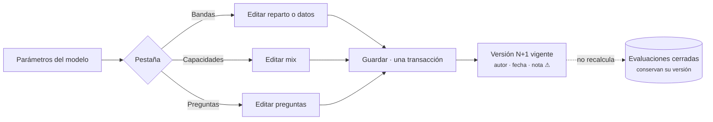

**Crear una línea y designar su lead.** La línea nace activa y sin lead; designar lead incorpora a la persona a la línea y es lo que la convierte en Líder de Expertise.

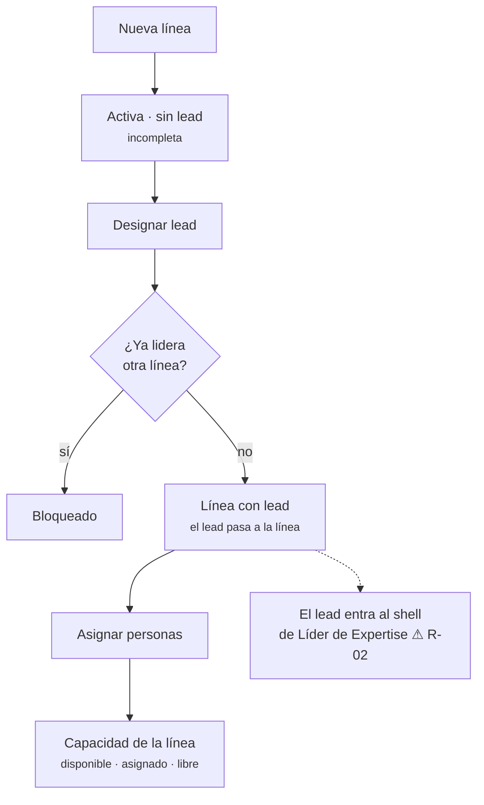

**Ingesta DevOps** *(por construir)*.

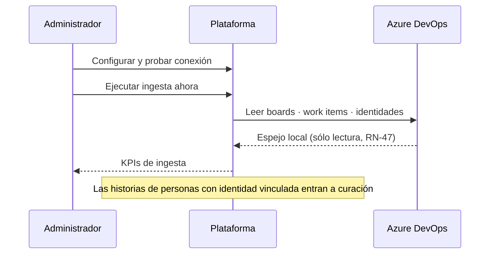

---

## 4. Líder de Expertise

**Quién es.** El *Chapter Lead* del doc maestro: la persona que el Administrador designa lead de una línea de expertise. Es el rol protagonista, el dueño de las personas y el aprobador único de ausencias, horas, rebalanceos y prefacturas de su gente. Todo lo que ve —personas, células, ausencias, backlog, prefacturas, competencias— llega acotado a su línea; las células se listan completas porque son de la organización, pero su equipo y sus cifras salen sólo de su gente.

### Funciones

| Función | Estado |
|---|:---:|
| Torre de control: FTE de la línea, personas con margen, células que necesitan gente; asignar, mover o subir dedicación con vista previa | ✅ |
| Células: crear, editar, eliminar; asignar, editar y quitar personas (BAU + Transformación = dedicación) | ✅ |
| Personas: crear, editar, eliminar; marcar externas con proveedor; asignar líder técnico; editar stacks; vincular identidad DevOps | ✅ |
| Iniciativas: crear, editar, evaluar (tamizaje + 7 dimensiones + plazo), activar (una activa por célula) y cerrar | ✅ |
| Backlog: clasificar (Iniciativa / BAU / Descartar), saltar, rechazar con motivo y reasignar, deshacer | ✅ |
| Horas: validar el reporte de cada persona; devolverlo con observación; recordar a quien no envió | 🟡 botón por persona; sin cola, devolución ni recordatorio |
| Células: designar el Líder Técnico de cada célula | ❌ ⚠ R-03 |
| Atender solicitudes de capacidad de Líderes Técnicos y Product Owners: simular en la Torre, aplicar o rechazar con motivo | ❌ |
| Ausencias: registrar en nombre de alguien, aprobar, rechazar, revertir con motivo | ✅ |
| Prefacturación de externos: generar esperado, registrar, ajustar, corregir, aprobar u objetar | ✅ |
| Competencias: evaluar habilidades (abrir, diligenciar, cerrar, reevaluar); plan de carrera (registrar acciones, marcar cumplidas); mapa de brechas | ✅ |
| Vincular tablero DevOps ↔ célula; ejecutar ingesta manual | ❌ |
| Portafolio, capacidad vs demanda, calibración estimado / real (módulos 1.2–1.4 del doc) | ❌ |
| Ver su propia línea (personas, lead, capacidad) sin entrar a Admin | ❌ ⚠ R-13 |

### Pantallas

| Pantalla | Ruta | Acceso | Estado |
|---|---|---|:---:|
| Torre de control | `/app/lead` | gestiona | ✅ |
| Gestionar Iniciativas · Evaluación | `/app/lead/iniciativas` · `/:id/evaluacion` | gestiona | ✅ |
| Gestionar Células · Detalle | `/app/lead/celulas` · `/:id` | gestiona | ✅ |
| Gestionar Personas · Detalle · Evaluación | `/app/lead/personas` · `/:id` · `/:id/evaluacion` | gestiona | ✅ |
| Gestionar Ausencias | `/app/lead/ausencias` | gestiona | ✅ |
| Gestionar Backlog | `/app/lead/backlog` | gestiona | ✅ |
| Prefacturación · Detalle | `/app/lead/facturacion` · `/:id` | gestiona | ✅ |
| Competencias · Plan de una persona | `/app/lead/competencias` · `/:personId` | gestiona | ✅ |
| Reporte de horas del sprint (cola: sin enviar, fuera de tolerancia, validar, devolver, recordar) | `/app/lead/horas` | gestiona | ❌ |
| Solicitudes de capacidad recibidas | `/app/lead/solicitudes` | gestiona | ❌ |
| Portafolio · Capacidad vs demanda · Calibración | `/app/lead/portafolio` · `/demanda` · `/calibracion` | gestiona | ❌ |
| Tablero DevOps de la célula (pestaña del detalle) | `/app/lead/celulas/:id` | gestiona | ❌ |
| Mi línea | `/app/lead/linea` | lectura | ❌ |
| Mi trabajo (capa Colaborador, §7) | `/app/colab/*` | propio | ❌ |

### Flujos

**Día a día: Torre de control y reasignación.**

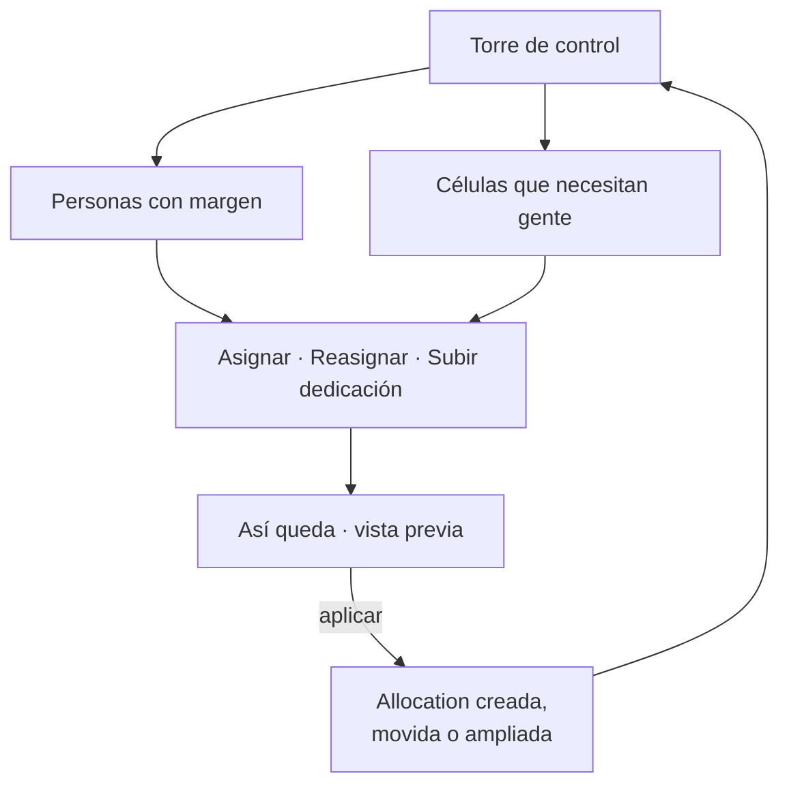

**Iniciativa: evaluar y activar.** Toda iniciativa nace en evaluación; activar exige evaluación guardada y célula sin otra activa (RN-01).

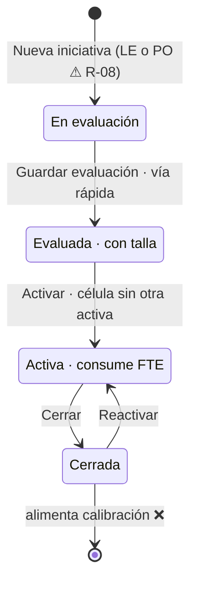

**Ausencia → capacidad → prefactura.** Sólo lo aprobado descuenta capacidad y alimenta el descuento de la prefactura; revertir es rechazar con motivo.

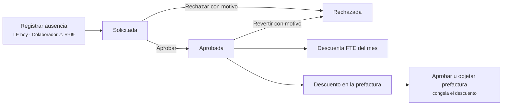

**Competencias: evaluar y cerrar brechas.** Cerrar una evaluación es irreversible y congela niveles + versión del catálogo; la brecha sólo se mueve con una nueva evaluación cerrada.

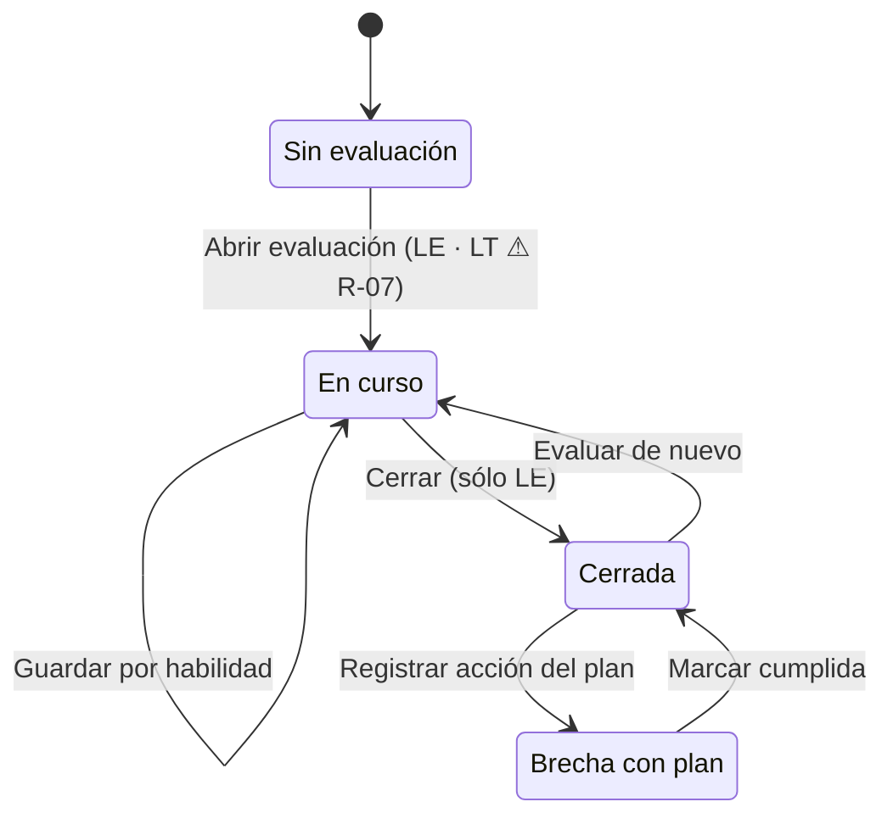

---

## 5. Líder Técnico

**Quién es.** ⚠ R-03. No existe en el doc maestro. En el código es un valor del catálogo (`TechnicalLead`) y una relación informativa persona → líder técnico («quién la acompaña técnicamente; no decide qué ve»). Propuesta: **líder técnico de una célula**, designado por el Líder de Expertise en la célula (`Squad.technicalLeadId`, campo nuevo). Su ámbito es la célula que lidera, con gente de varias líneas; puede pertenecer a una línea distinta de la de su equipo. Es el dueño del **trabajo**, no de las personas: no las crea, no las mueve, no aprueba nada sobre ellas y no ve costo, documento ni proveedor. Cuando le falta gente, la pide.

### Funciones

| Función | Estado |
|---|:---:|
| Ver su célula: equipo, dedicación BAU / Transformación, capacidad, criticidad, iniciativa activa, estado del reporte del sprint de cada persona | ❌ |
| Clasificar y curar el backlog de su célula (Iniciativa / BAU / Descartar; saltar; rechazar con motivo y reasignar). El Líder de Expertise conserva la cola global y *Deshacer* | ❌ ⚠ R-04 |
| Marcar «arquitectura definida» y mapear Epics del tablero a la iniciativa de la célula (gate de Etapa 2, doc §8.6). Absorbe al Arquitecto | ❌ ⚠ R-05 |
| Solicitar capacidad al Líder de Expertise: cargo, FTE, desde cuándo, motivo; ver la respuesta | ❌ |
| Seguir el reporte de horas de su equipo y recordar a quien no envió. Validar sigue siendo del Líder de Expertise | ❌ ⚠ R-06 |
| Abrir y diligenciar la evaluación de habilidades de su equipo; proponer acciones del plan. Cerrar sigue siendo del Líder de Expertise | ❌ ⚠ R-07 |
| Editar descripción y criticidad de su célula; ver el tablero DevOps vinculado | ❌ |
| Todo lo del Colaborador para sí mismo (§7) | ❌ |

### Pantallas

| Pantalla | Ruta | Acceso | Estado |
|---|---|---|:---:|
| Mi célula (home): equipo, capacidad, iniciativa, pendientes | `/app/tech` | propio | ❌ (reutiliza `SquadDetail` y `SquadTeamStatsCards`) |
| Backlog de mi célula (misma cola de triage, acotada a la célula) | `/app/tech/backlog` | propio | ❌ (reutiliza `BacklogContainer`) |
| Iniciativa de la célula: resultado, arquitectura definida, Epic mapeado | `/app/tech/iniciativas/:id` | propio | ❌ |
| Personas de mi célula · Evaluación de habilidades | `/app/tech/equipo/:id` · `/:id/evaluacion` | propio | ❌ (reutiliza detalle y `AssessmentContainer`) |
| Solicitudes de capacidad | `/app/tech/solicitudes` | propio | ❌ |
| Mi trabajo (capa Colaborador, §7) | `/app/colab/*` | propio | ❌ |

### Flujos

**Home: pendientes de la célula.**

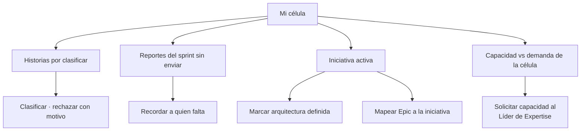

**Curación en la célula.** La misma cola del Líder de Expertise, acotada a su equipo; saca al lead del cuello de botella.

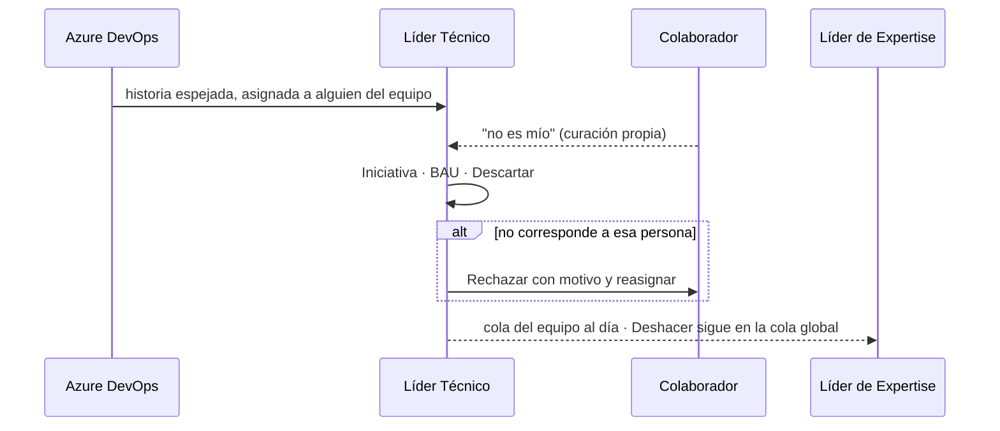

**Gate de Etapa 2 de estimación.**

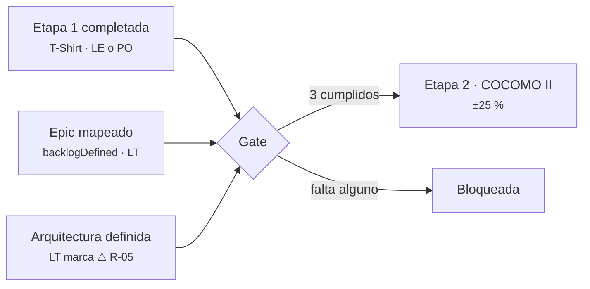

---

## 6. Product Owner

**Quién es.** Dueño de la iniciativa (rol `ProductOwner` del catálogo; hoy «Product Owner» es sólo un texto en el formulario de iniciativa). Pide capacidad con una iniciativa bien dimensionada y necesita saber, sin preguntar, qué talla tiene, quién la ejecuta y si está cubierta. No ve personas como capacidad: ve cobertura. Es el «Evaluador de iniciativa» del doc maestro cuando la evalúa él.

### Funciones

| Función | Estado |
|---|:---:|
| Registrar su iniciativa (nombre, plazo objetivo). Nace en evaluación y sin célula; el Líder de Expertise la asigna y activa | ❌ ⚠ R-08 |
| Responder tamizaje y las 30 preguntas, ajustar el plazo, guardar la evaluación (mismo asistente del lead). Opcional: repartir el scoring — negocio (dimensiones 1, 2, 6, 7) al PO, técnicas (3, 4, 5) al Líder Técnico ⚠ R-20 | ❌ (asistente ✅ bajo `/app/lead`) |
| Solicitar activación y capacidad para su iniciativa; ver la respuesta y el motivo si se rechaza (célula con otra activa) | ❌ |
| Ver talla, PM, FTE esperado y mix de capacidades de cada iniciativa suya | ❌ |
| Seguir el estado (evaluación · activa · cerrada), la célula asignada y la cobertura: FTE asignado vs demandado, alerta SFIA | ❌ |
| Ver las historias clasificadas a su iniciativa y el avance por sprint | ❌ |
| Ver portafolio y capacidad vs demanda de la organización (lectura) | ❌ |

### Pantallas

| Pantalla | Ruta | Acceso | Estado |
|---|---|---|:---:|
| Mi portafolio (home): mis iniciativas, estado, talla, cobertura | `/app/po` | propio | ❌ |
| Nueva iniciativa · Evaluar (reutiliza el asistente) | `/app/po/iniciativas/nueva` · `/:id/evaluacion` | propio | ❌ |
| Ficha y seguimiento de la iniciativa (con «Solicitar activación» y «Solicitar capacidad») | `/app/po/iniciativas/:id` | propio | ❌ |
| Capacidad vs demanda (mismo contenedor que el LE, sin nombres ni costos) | `/app/po/demanda` | lectura | ❌ |

### Flujos

**Registrar y evaluar mi iniciativa.** El PO dimensiona; el Líder de Expertise asigna célula y activa.

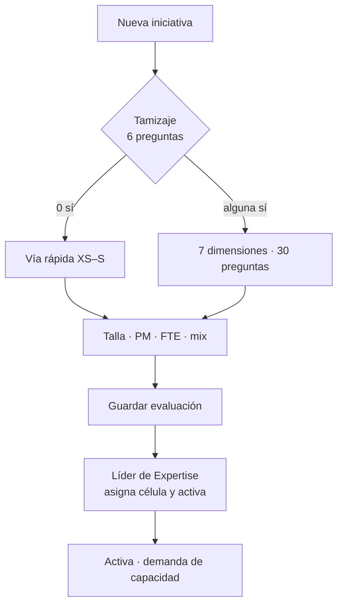

**Seguir mi iniciativa.** Una ficha que junta lo pedido (mix de la talla) con lo real (equipo de la célula, historias clasificadas).

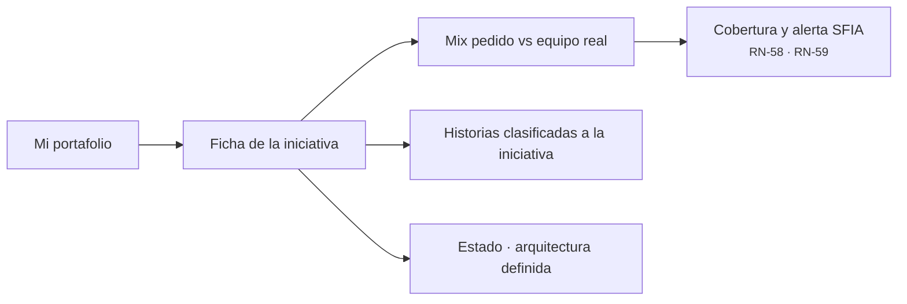

---

## 7. Colaborador

**Quién es.** Cualquier persona que ejecuta sin liderar: Dev, QA, arquitecto sin liderazgo (rol `Contributor`). Su ámbito es lo propio; de los demás sólo ve los nombres de sus compañeros de célula. Cierra el ciclo de la realidad: sin su reporte de horas y su curación no hay FTE real (doc §7.2, §7.3). Es la capa que heredan Líder Técnico y Líder de Expertise.

### Funciones

| Función | Estado |
|---|:---:|
| Ver su sprint: célula, dedicación, BAU / Transformación, horas esperadas, fecha de cierre | ❌ |
| Reportar horas del sprint (Iniciativa · BAU · libre): guardar borrador, enviar dentro de la tolerancia (RN-43); corregir y reenviar si el lead lo devuelve con observación | ❌ (estados sólo en semillas) |
| Curar sus work items: confirmar o «no es mío» con motivo (RN-51 a RN-53) | ❌ (hoy lo hace el lead en la cola) |
| Ver su ficha: asignación, stacks (editar los propios ⚠), identidad DevOps, utilización histórica | ❌ |
| Ver su evaluación cerrada y su plan de carrera; marcar acciones cumplidas ⚠ | ❌ |
| Solicitar ausencias y ver su estado y el motivo de rechazo | ❌ ⚠ R-09 |

### Pantallas *(del MVP v7, `NAV.colab`)*

| Pantalla | Ruta | Acceso | Estado |
|---|---|---|:---:|
| Mi trabajo (home): sprint, pendientes, utilización | `/app/colab` | propio | ❌ |
| Mi reporte de horas | `/app/colab/horas` | propio | ❌ |
| Mi backlog (items por confirmar · confirmados) | `/app/colab/backlog` | propio | ❌ |
| Mi capacidad (ficha, stacks, evaluación, plan, identidad DevOps) | `/app/colab/perfil` | propio | ❌ |
| Mis ausencias | `/app/colab/ausencias` | propio | ❌ |

### Flujos

**Reportar horas del sprint** (doc §8.1).

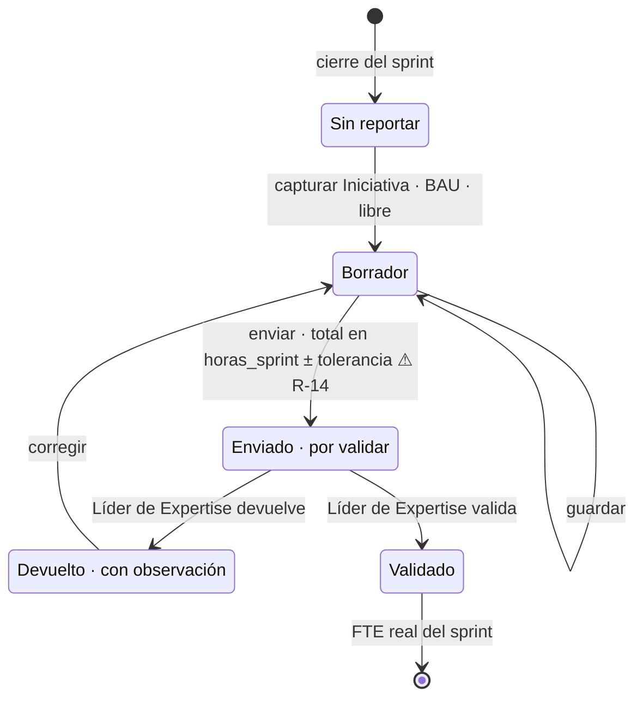

**Curar mis work items** (doc §8.3).

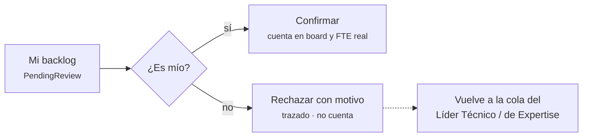

**Mis ausencias** (autoservicio, ⚠ R-09).

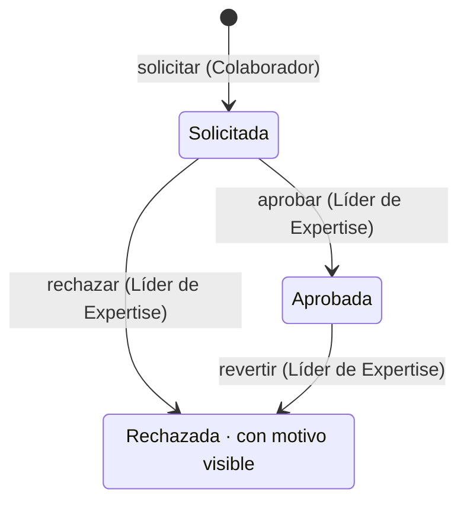

---

## 8. Matriz rol × acción

Leyenda: **●** gestiona · **◐** en su ámbito (su célula / sus iniciativas / lo propio) · **○** lectura · **—** sin acceso. La columna *Estado* dice si la acción existe hoy; el rol que la ejecuta hoy es siempre el que tiene ● y sesión (Admin o LE).

| Acción | Admin | Líder de Expertise | Líder Técnico | Product Owner | Colaborador | Estado |
|---|:---:|:---:|:---:|:---:|:---:|:---:|
| **Configuración** | | | | | | |
| Configurar calendario de sprints | ● | ○ | — | — | — | ✅ |
| Editar parámetros del modelo (bandas, mix, preguntas) | ● | ○ | — | ○ | — | ✅ · versionado ❌ |
| Administrar catálogo de habilidades y nivel por cargo | ● | ○ | ○ | — | — | ✅ |
| Líneas: crear, archivar, designar lead, repartir personas | ● | ○ la suya | — | — | — | ✅ · lectura LE ❌ |
| Configurar conexión Azure DevOps | ● | — | — | — | — | ❌ |
| Ejecutar ingesta manual | ● | ● | — | — | — | ❌ |
| **Capacidad** *(ámbito: la línea)* | | | | | | |
| Crear, editar y eliminar células | — | ● ⚠ R-18 | ◐ descripción y criticidad | ○ | ○ | ✅ · LT ❌ |
| Designar el Líder Técnico de una célula | — | ● | ○ | — | — | ❌ ⚠ R-03 |
| Solicitar capacidad para una célula o iniciativa | — | ● atiende | ◐ | ◐ | — | ❌ |
| Crear y editar personas (ficha, rol, líder técnico, proveedor) | — | ● | ○ | — | ◐ ver la propia | ✅ |
| Eliminar persona | — | ● | — | — | — | ✅ |
| Ver costo mensual, documento y proveedor | — | ● | — | — | ◐ | ✅ |
| Asignar, mover o quitar de una célula; cambiar dedicación | — | ● | ○ | ○ | ◐ ver | ✅ |
| Editar stacks de una persona | — | ● | ○ | — | ◐ ⚠ | ✅ · propio ❌ |
| Vincular identidad DevOps ↔ persona | — | ● | ○ | — | ◐ ver | 🟡 mock |
| Vincular tablero DevOps ↔ célula | ● | ● | ○ | — | — | ❌ |
| **Demanda** | | | | | | |
| Crear y editar iniciativas | — | ● | ○ | ◐ ⚠ R-08 | — | ✅ · PO ❌ |
| Evaluar iniciativa (tamizaje + 7 dimensiones) | — | ● | ○ | ◐ | — | ✅ · PO ❌ |
| Activar y cerrar iniciativa | — | ● ⚠ R-16 | ○ | ◐ solicita | — | ✅ · solicitud ❌ |
| Marcar arquitectura definida · mapear Epic | — | ● | ◐ ⚠ R-05 | ○ | — | ❌ |
| **Realidad del sprint** | | | | | | |
| Clasificar backlog (Iniciativa / BAU / Descartar) | — | ● | ◐ ⚠ R-04 | ○ de su iniciativa | — | ✅ · LT ❌ |
| Curar work items (confirmar / «no es mío») | — | ● | ◐ | — | ◐ | 🟡 sólo en la cola del LE |
| Reportar horas del sprint | — | ◐ | ◐ | — | ◐ | ❌ |
| Validar reportes de horas · devolver con observación | — | ● | ○ ⚠ R-06 | — | ◐ corregir | 🟡 por persona · devolver ❌ |
| Recordar reporte pendiente | — | ● | ◐ | — | — | ❌ |
| **Personas** | | | | | | |
| Registrar ausencia en nombre de otro | — | ● | — | — | — | ✅ |
| Solicitar ausencia propia | — | ◐ | ◐ | — | ◐ | ❌ ⚠ R-09 |
| Aprobar, rechazar o revertir ausencias | — | ● | ○ | — | — | ✅ |
| Evaluar habilidades: abrir y diligenciar | — | ● | ◐ ⚠ R-07 | — | ◐ ver | ✅ · LT ❌ |
| Cerrar evaluación | — | ● | — | — | — | ✅ |
| Plan de carrera: registrar acción · marcar cumplida | — | ● | ◐ proponer | — | ◐ marcar cumplida ⚠ | ✅ · propio ❌ |
| **Terceros** | | | | | | |
| Generar esperado y registrar prefactura | — | ● | — | — | — | ✅ |
| Ajustar, aprobar u objetar prefactura | — | ● | — | — | — | ✅ |
| **Lectura transversal** | | | | | | |
| Torre de control | — | ● | ○ su célula | — | — | ✅ |
| Portafolio y capacidad vs demanda | ○ ⚠ R-11 | ● | ○ | ● | — | ❌ |
| Calibración estimado vs real | ○ | ● | — | ○ | — | ❌ |
| Mapa de brechas (competencias) | — | ● | ○ su célula | — | ◐ las propias | ✅ |

---

## 9. Cadenas de aprobación entre roles

| Flujo | Quién inicia | Quién decide | Efecto | Estado |
|---|---|---|---|:---:|
| Ausencia | Colaborador solicita ❌ · LE registra ✅ | Líder de Expertise aprueba / rechaza / revierte | Descuenta capacidad del mes y prefactura del proveedor | 🟡 |
| Reporte de horas | Colaborador envía ❌ | Líder de Expertise valida o devuelve con observación | FTE real del sprint | 🟡 |
| Curación de work items | Ingesta → Colaborador o Líder Técnico confirma / rechaza ❌ | Líder de Expertise en la cola global (Deshacer) ✅ | Cuenta en board y FTE real | 🟡 |
| Iniciativa | PO registra, evalúa y solicita activación ❌ · LE ✅ | Líder de Expertise activa (una activa por célula) ⚠ R-16 | Demanda de capacidad | 🟡 |
| Solicitud de capacidad | Líder Técnico (para su célula) o PO (para su iniciativa) ❌ | Líder de Expertise simula en la Torre y aplica, o rechaza con motivo | Allocations; queda trazado el pedido y la respuesta | ❌ |
| Gate de Etapa 2 | Líder Técnico marca arquitectura definida · Epic mapeado ❌ | Automático (3 prerequisitos) | Habilita la estimación refinada | ❌ |
| Rebalanceo entre líneas | Líder de Expertise origen simula | Líder de Expertise destino aprueba ⚠ R-12 | Allocations | ❌ |
| Prefactura | Líder de Expertise transcribe la del proveedor | Líder de Expertise aprueba u objeta; el proveedor corrige fuera del sistema | Congela el descuento | ✅ |
| Parámetros del modelo | Administrador edita | Administrador (versionado con auditoría ⚠) | Evaluaciones nuevas | 🟡 |
| Evaluación de competencias | Líder Técnico diligencia ❌ · LE ✅ | Líder de Expertise cierra | Brechas → plan de carrera | 🟡 |

**El ciclo del sprint, visto por roles** (doc §7.2 y §7.3):

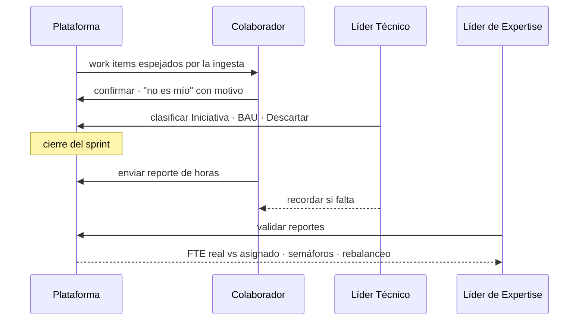

---

## 10. Pantallas para cerrar los roles

Prioridad por lo que desbloquea: sin sesión para los tres roles nuevos nada de lo demás se puede probar; sin reporte de horas y curación propia no existe el FTE real.

| Prio | Rol | Pantalla | Qué resuelve | Reutiliza |
|:---:|---|---|---|---|
| 1 | Todos | Sesión para 5 roles: claims, `APP_ROLES`, guards, redirección post-login al shell del rol | Hoy sólo entran Admin y Líder de Expertise; el login legacy cae en `/app/dashboard` | `auth-session`, `AuthGuard`, simulador |
| 1 | Todos | Llaves de ámbito en el contrato: `Squad.technicalLeadId` (lo designa el LE en el drawer de célula) e `Initiative.productOwnerId` (select en lugar del texto libre); el backend resuelve `oid` → persona → célula / iniciativas / lo propio | Sin estas dos referencias no existe «mi célula» ni «mis iniciativas»; hoy el mock sólo acota por línea | `SquadFormDrawer`, `InitiativeFormDrawer`, `scope.ts` |
| 1 | Colaborador | Mi trabajo · Mi reporte de horas · Mi backlog | La mitad del FTE real que hoy sólo existe en semillas; la curación que el doc asigna al colaborador | `HoursBySprintPanel`, cola de triage |
| 1 | Líder de Expertise | Reporte de horas del sprint (cola: sin enviar, fuera de tolerancia, validar en lote, recordar) | Sin cola el flujo del colaborador no cierra | botón «Validar» del detalle de persona |
| 1 | Líder Técnico | Mi célula · Backlog de mi célula | Saca al Líder de Expertise del cuello de botella de la curación | `BacklogContainer` con filtro, `SquadDetail` en lectura |
| 1 | Product Owner | Mi portafolio · Nueva iniciativa · Evaluar | Cierra al «Evaluador de iniciativa» del doc | `InitiativesList` filtrada, asistente de evaluación |
| 2 | LT · PO · LE | Solicitudes de capacidad: pedir (cargo, FTE, desde cuándo, motivo) y bandeja del LE con simular en la Torre, aplicar o rechazar | Formaliza el pedido entre dueño del trabajo y dueño de las personas, hoy negociado por fuera | `ReassignPersonDrawer` |
| 2 | Líder Técnico | Iniciativa de la célula: arquitectura definida, Epic mapeado | Flags que ya existen en la entidad `Initiative` del backend sin UI | `EvaluationHeader` |
| 2 | Product Owner | Ficha y seguimiento de la iniciativa | Talla y mix pedido vs equipo real; historias clasificadas | `SquadTeamStatsCards` |
| 2 | Colaborador | Mi capacidad · Mis ausencias | Ficha sin datos de terceros ni costo; solicitar y ver motivo de rechazo (`rejectReason` hoy no se muestra) | `PersonDetail`, `RegisterAbsenceDrawer` |
| 2 | Líder Técnico | Personas de mi célula · Evaluación | Diligenciar la evaluación de su gente (cerrar queda en el LE) | `AssessmentContainer` |
| 3 | LE · PO · Admin | Portafolio · Capacidad vs demanda · Calibración: un solo contenedor montado en cada shell, con nombres y costos sólo para el LE | Módulos 1.2–1.4 del doc, hoy sin pantalla | mix de capacidades de Admin |
| 3 | Líder de Expertise | Mi línea (lectura) · Tablero DevOps de la célula | Enlaces cruzados hoy apuntan a `/app/admin/*`, que el LE no puede abrir | `LineDetail`, `Squad.LinkDevOpsBoard()` |
| 3 | Administrador | Accesos (lectura) · Conexión e ingesta · Versionado | Placeholders actuales | — |

---

## 11. Mapeo técnico: Entra ID, sesión y ámbito

Decisión vigente (`add-auth-port-and-simulator`, resuelve A-03 del doc): **los roles llegan como claims del token**, no hay tabla local ni pantalla de usuarios. El backend no autentica; APIM valida el token y de ahí salen 401 y 403. Lo que cada rol *alcanza a ver* lo resuelve el backend a partir del `oid` del token, como ya hace el mock para el Líder de Expertise (`holderChapterId` en `chapters.ts`).

| Rol | App role en Entra | `AppRole` (`auth-session`) | `PersonRole` | Shell | Ámbito que el backend resuelve desde `oid` |
|---|---|---|---|---|---|
| Administrador | `Plataforma.Admin` ✅ | `admin` ✅ | `Administrator` | `/app/admin` ✅ | Ninguno: global |
| Líder de Expertise | `Plataforma.ChapterLead` ✅ | `chapter-lead` ✅ | `ExpertiseLead` | `/app/lead` ✅ | La línea cuyo lead es la persona con ese `oid` |
| Líder Técnico | `Plataforma.TechLead` ❌ | `tech-lead` ❌ | `TechnicalLead` | `/app/tech` ❌ | Células con `Squad.technicalLeadId` = esa persona (campo nuevo) ⚠ R-03 |
| Product Owner | `Plataforma.ProductOwner` ❌ | `product-owner` ❌ | `ProductOwner` | `/app/po` ❌ | Iniciativas con `Initiative.productOwnerId` = esa persona (hoy texto libre) |
| Colaborador | `Plataforma.Colaborador` ❌ | `collaborator` ❌ | `Contributor` | `/app/colab` ❌ | La persona con `Person.entraObjectId` = `oid` |

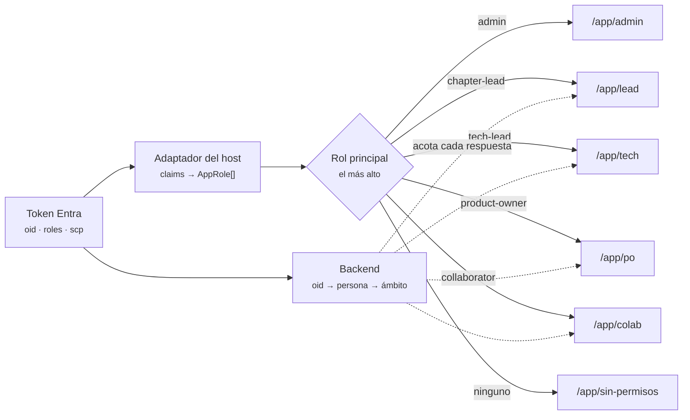

Reglas de implementación:

- **Claim decide acceso, `Person.role` dice qué es la persona en el negocio.** Deben coincidir; la incoherencia (alguien con claim de Líder Técnico cuyo rol en la ficha es Colaborador) se reporta en *Accesos*, no se resuelve en silencio (⚠ R-02).
- **Roles acumulables, shell único.** Quien tiene varios claims entra al shell del rol más alto; las entradas de «Mi trabajo» (horas, backlog propio, ausencias) se agregan a su menú con `roles?` en `LeadNavEntry` / `filterNavByRole`, que existen para esto y hoy no filtran nada (⚠ R-10).
- **Scopes existentes:** `capacidad.read`, `capacidad.write`, `parametros.write`. Propuesta mínima para los nuevos roles: `capacidad.read` + `horas.write` (Colaborador), + `backlog.write` (Líder Técnico), `iniciativas.write` (Product Owner).
- **Filtrar las dos puntas.** Al acotar por ámbito hay que acotar personas *y* lo indexado por persona (asignaciones, ausencias, prefacturas, historias); acotar sólo una punta produce FTE negativos y porcentajes > 100 (`scope.ts`).
- **Lectura puntual no se acota; enumerar y contar sí.** Una ficha se puede abrir por id llegando desde el propio listado; lo que el ámbito restringe es listar y sumar (`chapters.ts`).
- **Frontera de datos sensibles.** Costo mensual, documento, proveedor, prefacturas y evaluaciones cerradas de terceros: sólo el Líder de Expertise. El Líder Técnico ve de su equipo nombre, cargo, seniority, stacks y dedicación; el Administrador ve el padrón básico que ya usa Líneas; el Product Owner ve cobertura agregada, no personas. El contrato lo garantiza con DTOs distintos por rol, no ocultando columnas.
- **Nomenclatura.** El código dice `chapter` (`chapterId`, `chapter-lead`, `/app/lead`) y la UI «línea de expertise». Renombrar el claim a `expertise-lead` y la ruta es un refactor sin valor observable; se hace en un change propio o no se hace (⚠ R-17).

---

## 12. Decisiones pendientes

| # | Tema | Opciones | Recomendación | Impacto |
|---|---|---|---|:---:|
| **R-01** | Nombre del rol QA / Dev | Colaborador · Integrante · Especialista | **Colaborador** (§2) | Bajo |
| **R-02** | Fuente única del rol de sesión | Claims de Entra (decisión vigente) · tabla local · derivar de `Person.role` | Claims deciden; `Person.role` debe coincidir; pantalla *Accesos* en lectura para ver incoherencias | Alto |
| **R-03** | Ámbito del Líder Técnico | Célula que lidera vía `Squad.technicalLeadId` (nuevo) · personas con `Person.technicalLeadId` (existe, declarado informativo) · ambas | **Por célula**: su trabajo (backlog, iniciativa, tablero, sprint) está indexado por célula y «una persona, una célula» lo hace limpio. `Person.technicalLeadId` sigue siendo acompañamiento informativo. Una célula tiene a lo sumo un LT; decidir si un LT puede liderar varias | Alto |
| **R-04** | ¿El Líder Técnico clasifica el backlog o sólo cura? | Clasifica su célula · sólo cura y el LE decide (doc §4.2) | Clasifica su célula; la cola global y *Deshacer* quedan en el LE | Medio |
| **R-05** | Rol Arquitecto | Rol propio · lo absorbe el Líder Técnico · lo absorbe el LE | Líder Técnico marca «arquitectura definida»; un arquitecto que no lidera es Colaborador | Medio |
| **R-06** | Validación de horas | LE (doc §8.1) · Líder Técnico · ambos | LE valida (en lote por sprint); el Líder Técnico recuerda | Medio |
| **R-07** | Evaluación de competencias | Sólo LE · LT diligencia y LE cierra | LT diligencia y propone acciones; cerrar y trayectoria son del LE (el chapter «gestiona trayectoria de carrera y permisos», decisión 4b del doc) | Medio |
| **R-08** | Product Owner y la iniciativa | Registra y evalúa (propuesta) · sólo evalúa lo que creó el LE (doc §4.2 lectura) | Registra y evalúa; nace sin célula; el LE asigna célula y activa. Ve cobertura agregada, no personas | Alto |
| **R-09** | Ausencias | Autoservicio del Colaborador + aprobación del LE · el LE registra en nombre de la persona (hoy) | Autoservicio; mostrar `rejectReason` (hoy se persiste y no se ve) | Medio |
| **R-10** | Personas con varios roles | Shell del rol más alto + entradas «Mi trabajo» · selector de rol en la topbar (MVP v7) | Shell único con menú combinado; `filterNavByRole` ya existe | Medio |
| **R-11** | Administrador y datos de negocio | Cero acceso (mocks: sin pantallas) · lectura global de portafolio y capacidad vs demanda (doc §4.2 👁) | Lectura de portafolio y capacidad vs demanda; nada de personas | Bajo |
| **R-12** | Rebalanceo entre líneas | Aplica directo · visto bueno del LE receptor (propuesta §8.7 del doc, A-08) | Visto bueno del receptor | Medio |
| **R-13** | El LE y su propia línea | `/app/lead/linea` en lectura · darle acceso a `/app/admin/lineas` | Lectura en su shell; los enlaces cruzados a `/app/admin/*` hoy le dan 403 | Bajo |
| **R-14** | RN-43 (76–84 h) en el reporte del Colaborador | Bloquea el envío · avisa y el LE decide al validar | Bloquea: el doc lo define como gate de *Enviado* | Bajo |
| **R-15** | Lo propio editable por el Colaborador | Stacks y «marcar cumplida» editables · sólo lectura | Stacks editables (los conoce él); acciones del plan las cierra el LE, el Colaborador propone | Bajo |
| **R-16** | Dueño de activar / cerrar la iniciativa | LE (doc §4.2) · Líder Técnico (la regla «una activa por célula» es de la célula) | LE: activar consume FTE de la línea. El PO solicita, el LT informa que la célula está lista | Medio |
| **R-17** | Renombrar `chapter-lead` → `expertise-lead` y `/app/lead` | Ahora · al archivar `add-auth-port-and-simulator` · nunca | Change propio, sin mezclar con los roles nuevos | Bajo |
| **R-18** | Maestro de células | Sigue en el LE (hoy) · pasa a Admin como dato estructural (equipo, criticidad) y el LE / LT sólo editan | Sigue en el LE mientras una célula tenga gente de una sola línea en la práctica; revisar cuando una célula mezcle líneas | Medio |
| **R-19** | Prefactura: registrar y aprobar en la misma persona | Basta la trazabilidad (nota obligatoria si hay diferencia) · segundo aprobador | Trazabilidad; no existe hoy un rol financiero | Bajo |
| **R-20** | Reparto del scoring de la iniciativa | Un solo evaluador (LE o PO) · negocio al PO (1, 2, 6, 7) y técnicas al LT (3, 4, 5) | Un solo evaluador en la primera versión; el reparto reduce subjetividad pero exige dos sesiones para una talla | Bajo |
